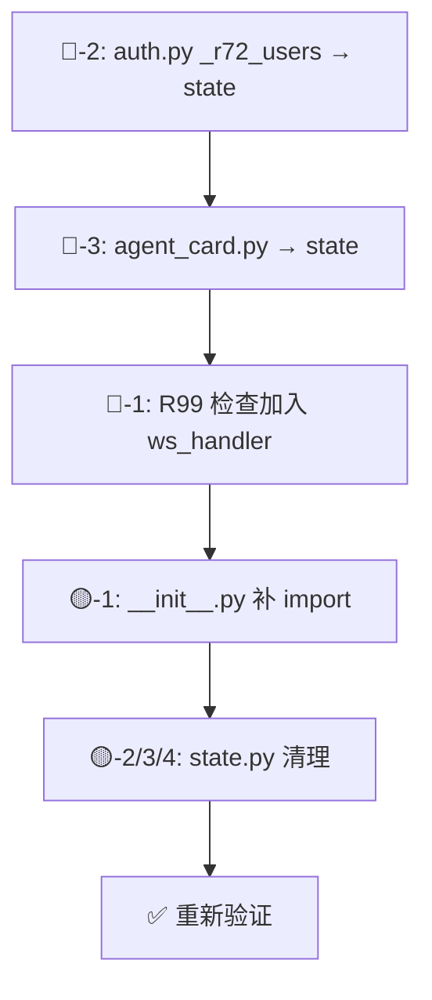

# R100 代码审查报告 — 服务端核心重构：handler.py 拆分 🏗️

> **版本：** v1.0  
> **审查者：** 🔍 小周  
> **审查 commit 基线：** `dev` 分支  
> **审查范围：** **2 commits**  
>   - `56f4edb` — git mv handler.py → main.py  
>   - `d9f0268` — feat: 编码拆分完成  
> **审查日期：** 2026-07-11  
> **方案文档：** `docs/R100/R100-tech-plan.md` v1.0  
> **需求文档：** `docs/R100/R100-product-requirements.md` v1.0  
> **相关文件：** 8 新增 + 2 修改 + 1 删除，21 文件 +9644/-7074 行

---

## 审查结论

| 类别 | 数量 |
|:-----|:----:|
| 🔴 **不通过** | **3** |
| 🟡 **注意** | **4** |
| 🟢 **通过** | **8** |
| **总体** | 🔴 **不通过 — 3 项需修正后方可合并** |

---

## 🔴 不通过项

### 🔴-1: R99 权限检查从生产路径丢失（严重）

**描述：** R99 的 level 权限检查被放入了 `main.handler()`（legacy websockets 路径），但实际生产路径使用 `__main__.ws_handler()`（aiohttp 路径），后者直接调 `handle_broadcast()` 跳过了 level 检查。

**代码路径对比：**

| 路径 | 位置 | 是否含 R99 检查 |
|:-----|:------|:---------------:|
| ✅ `main.handler()` L2599 | legacy websockets handler | 有 |
| ❌ `__main__.ws_handler()` L50-60 | **aiohttp 生产路径** | **无** |

**影响：** 所有 bot 的 `_inbox:<bot_id>` 消息完全不经过 level 检查，L2/L3 bot 可以给其他 bot 发消息。功能退化（regression）。

**修复方案：** 将 R99 level 检查加入 `__main__.ws_handler()` 的 `"message"` 处理分支，在 R87 `_handle_server_relay` 之后、`handle_broadcast` 之前插入：

```python
# ═══ R99: 权限检查 — _inbox:<bot_id> 需要 level>=4 ═══
_channel = data.get("channel", "")
if _channel.startswith(p.INBOX_CHANNEL_PREFIX) and _channel != f"{p.INBOX_CHANNEL_PREFIX}server":
    from . import auth as _auth  # 或顶层 import
    _sender_level = _auth.get_level(agent_id)
    if _sender_level < 4:
        await ws.send_json({
            "type": "error",
            "error": f"❌ 无权限：当前等级 L{_sender_level}，需 L4 才能向其他 Bot 发消息。",
        })
        continue
# ════════════════════════════════════════════════════
```

**或更好的方案：** 在 `handle_broadcast` 入口处统一检查（让两个路径都覆盖），但需注意 `_inbox:server` 豁免逻辑。

---

### 🔴-2: `auth.py` 引用 `main._r72_users` 失效

**描述：** `auth.py` L152-153 使用 `getattr(_handler, "_r72_users", {})` 获取 R72 注册 agent 的用户名映射。但 `_r72_users` 已被迁至 `state.py`，`main.py` 不再持有该变量。

**代码：** `server/auth.py` L152-153
```python
from . import main as _handler
r72 = getattr(_handler, "_r72_users", {})  # ← 永远返回 {}
```

**影响：** R72 注册的 agent 在 `get_agent_name()` 中显示名返回 agent_id（fallback），所有聊天消息显示名断裂。

**修复方案：** 改为 `getattr(state, "_r72_users", {})`：
```python
from . import state as _state  # 或已有的 state 引用
r72 = getattr(_state, "_r72_users", {})
```

且需要处理 `state` 是否已在 auth.py 的 import 路径中。如果尚未 import，在函数内（延迟 import）：
```python
from . import state as _state
r72 = _state._r72_users
```

---

### 🔴-3: `agent_card.py` 引用 `main._ROLE_AGENT_MAP` / `main._pipeline_manager` 缺失

**描述：** `agent_card.py` L401-414 通过 `_handler_mod._ROLE_AGENT_MAP` 和 `_handler_mod._pipeline_manager` 访问角色映射和管线管理器。但这些变量已在 `state.py` 中，`main.py` 不持有。

**代码：** `server/agent_card.py` L401-414
```python
from . import main as _handler_mod
mgr = _handler_mod._pipeline_manager  # ← AttributeError
if r not in _handler_mod._ROLE_AGENT_MAP:  # ← AttributeError
    _handler_mod._ROLE_AGENT_MAP[r] = []
```

**影响：** Agent Card 提交时触发 `AttributeError`，try/except 可能捕获但功能缺失。

**修复方案：** 改为引用 `state`：
```python
from . import state as _state
mgr = _state._pipeline_manager
if r not in _state._ROLE_AGENT_MAP:
    _state._ROLE_AGENT_MAP[r] = []
```

---

## 🟡 注意项

### 🟡-1: `commands/__init__.py` — `_handle_pipeline_command` 未导入即引用

**描述：** `_ADMIN_COMMANDS` 注册表中 `"pipeline"` 命令的 handler 为 `_handle_pipeline_command`，但该符号在 `commands/__init__.py` 的 import 语句中缺失。

**代码：**
```python
# __init__.py 中从 pipeline 导入的列表：
from .pipeline import (
    _cmd_pipeline_start, _cmd_pipeline_stop, _cmd_pipeline_activate,
    _cmd_pipeline_status, _cmd_pipeline_mode, _cmd_pipeline_role_override,
    _cmd_step_complete, _cmd_step_force, _cmd_step_handoff,
    _cmd_step_verify, _cmd_step_reject,
)  # ← 缺少 _handle_pipeline_command

# 但 _ADMIN_COMMANDS 引用它：
"pipeline": {
    "handler": _handle_pipeline_command, ...  # ← NameError
}
```

**影响：** 模块加载时触发 `NameError`，`!pipeline` 命令无法注册，但由于 `main.py` 使用延迟 import（L1394），该错误在首次执行 `!pipeline` 命令时才会暴露。

**修复方案：** 在 `from .pipeline import (...)` 中加入 `_handle_pipeline_command`。

---

### 🟡-2: `state.py` 含函数定义

**描述：** 技术方案明确要求 `state.py` 为"纯数据结构，不含任何 `def` 函数逻辑"，但实际文件包含 `is_server_inbox()` 函数（L45-47）。

**代码：** `server/state.py` L45-47
```python
def is_server_inbox(channel: str) -> bool:
    """判断 channel 是否为 server 中继通道。"""
    return channel == SERVER_INBOX_CHANNEL
```

**影响：** 轻度违反设计约定。`is_server_inbox` 只有一个调用方（可能在 `handle_broadcast` 中），应直接使用 `channel == SERVER_INBOX_CHANNEL`。

**修复方案：** 将函数移回 `main.py`（或其调用方），`state.py` 仅保留 `SERVER_INBOX_CHANNEL` 常量。

---

### 🟡-3: `state.py` 重复变量定义

**描述：** `_ROLE_AGENT_MAP` 和 `_step_ack_states` 各定义两次。

**代码：**
```python
# L57-60（第一次 — 有 DEPRECATED 注释）
_ROLE_AGENT_MAP: dict[str, list[str]] = {}    # role -> [agent_id, ...] (Phase 3)
_step_ack_states: dict[str, dict] = {}          # "{round}/{step}" -> state info (Phase 4)

# L65-66（第二次 — 无 DEPRECATED 注释，覆盖第一次）
_ROLE_AGENT_MAP: dict[str, list[str]] = {}
_step_ack_states: dict[str, dict] = {}
```

**影响：** 逻辑上第二个定义覆盖第一个（同一对象），不影响运行时行为。但阅读代码时令人困惑，且若后续有 PR 只改第一处，改动会丢失。

**修复方案：** 删除 L57-63 的第一次定义（含 `# R78 A` 和 `# R78 B` 注释块）。

---

### 🟡-4: `state.py` 使用未解析的前向引用

**描述：** `_card_watcher` 的类型注释使用 `"ac_mod.CardFileWatcher | None"`，但 `ac_mod` 在 `state.py` 中未定义。

**代码：** `server/state.py` L124
```python
_card_watcher: "ac_mod.CardFileWatcher | None" = None
```

**影响：** Python 3.10+ 使用 `from __future__ import annotations` 时字符串注释不会解析，无运行时影响。但若在运行时需要求值（如 dataclass field、pydantic），会触发错误。

**修复方案：** 改为使用 `type` 模块导入或字符串 `"CardFileWatcher | None"`（去掉 `ac_mod.` 前缀），或 import `ac_mod` 但注意循环依赖。

---

## 🟢 通过项

### 🟢-1: handler.py → main.py 改名完成

**详细：**
- `handler.py` 已从 git 中彻底删除 ✅
- `main.py` 以新文件名存在，含 3,458 行（比旧 7,024 行减少 51%）
- 文件名 docstring 正确标注 "R100: renamed to main.py" ✅

### 🟢-2: `_cmd_*` 零残留

**验证结果：** `main.py` 中 `grep 'def _cmd_'` = **0 匹配**，所有 ~38 个 `_cmd_*` 函数已迁至 `commands/` 子模块。

| 文件 | 函数数 | 状态 |
|:-----|:------:|:----:|
| `commands/workspace.py` | 9 | ✅ |
| `commands/pipeline.py` | 11 | ✅ |
| `commands/agent_card.py` | 9 | ✅ |
| `commands/task.py` | 6 | ✅ |
| `commands/admin.py` | 8 | ✅ |

### 🟢-3: 全部 5 个 commands/ 领域文件存在

**目录结构：**
```
server/commands/
├── __init__.py     (201 行)
├── workspace.py    (451 行)
├── pipeline.py     (2,051 行)
├── agent_card.py   (255 行)
├── task.py         (193 行)
└── admin.py        (170 行)
```

与技术方案一致 ✅

### 🟢-4: state.py 存在，含大部分共享变量

- `state.py` 134 行，包含技术方案清单中的全部变量 ✅
- `state._pipeline_manager` 初始化为 `None`（符合延迟初始化设计）✅

### 🟢-5: command_utils.py 存在，含全部预期工具函数

| 函数 | 行号 | 状态 |
|:-----|:----:|:----:|
| `_parse_command()` | L77 | ✅ |
| `_check_command_permission()` | L129 | ✅ |
| `_send_cmd_response()` | — | ✅ |
| `_log_audit()` | L120 | ✅ |
| `_broadcast_to_channel()` | — | ✅ |
| `_resolve_workspace()` | L173 | ✅ |
| `_is_any_workspace_admin()` | L112 | ✅（额外） |

### 🟢-6: 无循环导入（模块级）

| 关键路径 | 策略 | 结果 |
|:---------|:-----|:-----|
| `main → commands` | 延迟导入（L1394: `from .commands import _ADMIN_COMMANDS`） | ✅ |
| `command_utils → main` | 延迟导入 `from .main import _connections` / `_send` | ✅ |
| `commands/pipeline → main` | 命令函数通过 `state` 访问共享变量 | ✅ |
| `state → server 模块` | 零依赖（仅 stdlib + `pipeline_context`） | ✅ |

### 🟢-7: `__main__.py` import 路径全部更新

| 旧路径 | 新路径 | 状态 |
|:-------|:-------|:----:|
| `from .handler import ...` | `from .main import handle_auth, ...` | ✅ |
| `from .handler import handle_agent_card_register` | `from .main import handle_agent_card_register` | ✅ |
| `from .handler import handler as _handler_fn` | `from .main import handler as _handler_fn` | ✅ |
| `from .handler import _connections as _conns` | `from .main import _connections as _conns` | ✅ |
| `from .handler import _flush_offline_push` | `from .main import _flush_offline_push` | ✅ |
| `from .handler import _offline_push_queue, _offline_timers` | `from .state import _offline_push_queue, _offline_timers` | ✅ |

零 `from .handler` 残留 ✅

### 🟢-8: `auth.py` 和 `agent_card.py` 的延迟导入路径已更新

| 文件 | 旧 | 新 | 状态 |
|:-----|:---|:---|:----:|
| `auth.py` L152 | `from . import handler as _handler` | `from . import main as _handler` | ✅ 路径对但变量名不对（见 🔴-2） |
| `agent_card.py` L401 | `from . import handler as _handler_mod` | `from . import main as _handler_mod` | ✅ 路径对但变量名不对（见 🔴-3） |

---

## 验收清单

| # | 验收项 | 标准 | 结果 |
|:-:|:-------|:-----|:----:|
| V-11 | handler.py → main.py 行数 | 7024 → ~800 | 🟡 **3,458 行**（含 Phase 2 暂留子系统） |
| V-12 | commands/ 目录 | 含 __init__.py + 5 模块 | 🟢 **6 文件全部存在** |
| V-13 | state.py 存在 | 含全部共享变量 | 🟢 **存在**（见 🟡-2/3/4） |
| V-14 | command_utils.py 存在 | 含全部工具函数 | 🟢 **存在** |
| V-15 | 无循环导入 | 启动无 ImportError | 🟢 **延迟 import 策略正确** |
| — | `from .handler` 零残留 | — | 🟢 **已全部更新** |
| — | `_cmd_*` 零残留于 main.py | — | 🟢 **0 残留** |
| — | R99 level 检查在生产路径 | — | 🔴 **丢失** |
| — | auth.py 引用 `_r72_users` | 存活 | 🔴 **断裂** |
| — | agent_card.py 引用 `_ROLE_AGENT_MAP` | 存活 | 🔴 **断裂** |

---

## 修复建议优先级

| 优先级 | 项目 | 严重程度 | 预估工作量 |
|:-------|:-----|:---------|:-----------|
| **P0** | 🔴-1: R99 检查加入 `__main__.ws_handler()` | 安全退化 | ~10 行 |
| **P0** | 🔴-2: auth.py `_r72_users` 改为 `state._r72_users` | 显示名断裂 | ~2 行 |
| **P0** | 🔴-3: agent_card.py 改为 `state._ROLE_AGENT_MAP` / `state._pipeline_manager` | Agent Card 注册断裂 | ~4 行 |
| **P1** | 🟡-1: `__init__.py` 加入 `_handle_pipeline_command` 导入 | `!pipeline` 命令断裂 | ~1 行 |
| **P2** | 🟡-2/3/4: state.py 清理 | 代码质量 | ~8 行 |

---

## 建议的修复执行顺序



---

*审查由 🔍 小周完成，基于 `dev` `d9f0268`。*
