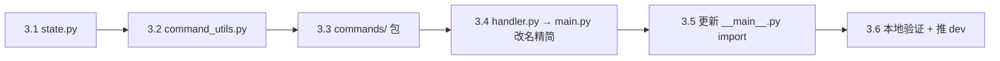

# R100 技术方案 — 服务端核心重构：handler.py 拆分 🏗️

> **版本：** v1.0
> **状态：** ✅ 定稿
> **架构师：** 🏗️ 小开
> **日期：** 2026-07-13
> **基线：** dev `ab9081f`（handler.py 7,024 行，146 个函数/方法）
> **基于：** `docs/R100/R100-product-requirements.md` + `server/README.md`
>
> **工作量：** 8 新增 + 2 修改，~3,900 行（拆分，零行为变更）

---

## 1. 基线确认

### 1.1 当前 handler.py 全景

```
handler.py (7,024 行 / 146 函数)
├── 30+ 模块级全局变量          (~100 行)   → state.py
├── 14 个 import 语句            (~20 行)    → 分散到各文件
├── 消息路由核心                 (~700 行)
│   ├── handler(ws)            主循环       → main.py 保留
│   ├── handle_broadcast()     消息路由+广播 → main.py 保留
│   ├── _handle_server_relay() inbox 中继   → main.py 保留
│   ├── _handle_server_query() inbox 查询   → main.py 保留
│   ├── handle_auth()          认证         → main.py 保留
│   ├── handle_register()      注册         → main.py 保留
│   ├── handle_agent_card_register()        → main.py 保留
│   └── _send()                WS 写入       → main.py 保留
├── 命令路由基础                 (~150 行)
│   ├── _parse_command()                     → command_utils.py
│   ├── _check_command_permission()          → command_utils.py
│   ├── _send_cmd_response()                 → command_utils.py
│   ├── _log_audit()                         → command_utils.py
│   ├── _broadcast_to_channel()              → command_utils.py
│   └── _resolve_workspace()                 → command_utils.py
├── _ADMIN_COMMANDS 注册表       (~400 行)   → commands/__init__.py
├── workspace 命令               (~500 行)   → commands/workspace.py
│   ├── _cmd_create_workspace   L646
│   ├── _cmd_close_workspace    L708
│   ├── _cmd_list_workspaces    L790
│   ├── _cmd_workspace_join     L4633
│   ├── _cmd_workspace_leave    L4666
│   ├── _cmd_workspace_add      L4701
│   ├── _cmd_workspace_remove   L4740
│   ├── _cmd_workspace_list_members L4783
│   └── _cmd_workspace_reset    L3782
├── pipeline 命令 + 辅助         (~1,200 行) → commands/pipeline.py
│   ├── _cmd_pipeline_start     L2487
│   ├── _cmd_pipeline_stop      L2615
│   ├── _cmd_pipeline_activate  L2571
│   ├── _cmd_pipeline_status    L4003
│   ├── _cmd_pipeline_mode      L4157
│   ├── _cmd_pipeline_role_override L4183
│   ├── _cmd_step_complete      L2851
│   ├── _cmd_step_force         L3310
│   ├── _cmd_step_handoff       L3803
│   ├── _cmd_step_verify        L3345
│   ├── _cmd_step_reject        L3642
│   ├── _handle_pipeline_command L2345
│   ├── _send_inbox_task        L2680
│   ├── _run_validation_hook    L2806
│   ├── _check_pm_or_admin      L2791
│   ├── _r57_switch_to_backup   L3455
│   ├── _r57_wait_for_ack       L3539
│   ├── _r59_auto_fallback_monitor L3559
│   ├── pipeline_exists         L1591
│   ├── set_lobby_paused        L1596
│   └── 管线辅助 ~20 个函数     L1300-1590
├── agent_card 命令              (~300 行)   → commands/agent_card.py
│   ├── _cmd_agent_card_list    L4220
│   ├── _cmd_agent_card_get     L4259
│   ├── _cmd_agent_card_set     L4286
│   ├── _cmd_agent_card_unset   L4317
│   ├── _cmd_agent_card_reload  L4331
│   ├── _cmd_agent_card_watch   L4339
│   ├── _cmd_agent_role_map     L4371
│   ├── _cmd_agent_card_register  L4408
│   └── _cmd_agent_card_auto_register L4437
├── task + rollcall 命令         (~400 行)   → commands/task.py
│   ├── _cmd_task_create        L961
│   ├── _cmd_task_update        L983
│   ├── _cmd_task_query         L1032
│   ├── _cmd_task_list          L1063
│   ├── _cmd_rollcall_role      L1077
│   └── _cmd_rollcall_next      L1108
├── admin 命令                   (~200 行)   → commands/admin.py
│   ├── _cmd_list_agents        L825
│   ├── _cmd_agent_status       L841
│   ├── _cmd_approve_ws_admin   L867
│   ├── _cmd_reject_ws_admin    L882
│   ├── _cmd_list_pending       L895
│   ├── _cmd_audit_log          L908
│   ├── _cmd_list_workspace_admins L933
│   └── _cmd_revoke_api_key     L4823
├── 看门狗子系统                 (~300 行)   → 暂留 main.py（Phase 2 再拆）
│   ├── _ensure_watchdog        L1620
│   ├── _watchdog_loop          L1803
│   ├── _watchdog_scan          L1813
│   ├── _trigger_timeout_escalation L1893
│   ├── _send_watchdog_alert    L2164
│   └── ~10 个辅助函数
├── ACK/超时子系统               (~300 行)   → 暂留 main.py（Phase 2 再拆）
│   ├── _ack_timeout_task       L1947
│   ├── _trigger_ack_escalation L2011
│   ├── _update_step_ack_state  L2065
│   └── ~8 个辅助函数
├── Git 同步                     (~200 行)   → 暂留 main.py（Phase 2 再拆）
├── 其他 msg_type 分支 handler   (~2000 行)  → 保留（与 handler() 强耦合）
└── 其他辅助函数                 (~300 行)   → 分散
    ├── _send_to_agent          L3403
    ├── _broadcast_task_notify  L4907
    ├── _notify_member_changed  L5660
    ├── _handle_rollcall_ack    L1295
    ├── _ensure_git_scan        L1634
    ├── _start_git_sync_loop    L1645
    ├── _auto_advance_pipeline  L1680
    ├── _restore_pipeline_timers L4874
    ├── _persist_broadcast      L1142
    ├── _persist_admin_response L495
    ├── 限流函数 ~6 个           L5689-5783
    ├── _can_broadcast          L5975
    └── ~10 个其他
```

### 1.2 确认需求文档声明

| 声明 | 实际 | 偏差 |
|:-----|:-----|:-----|
| handler.py 7024 行 | ✅ 7,024 行 | 一致 |
| 30+ _cmd_* 函数 | ✅ 38 个 _cmd_* 函数 | 一致（含 _cmd_agent_card_watch 等少量未列出的） |
| _ADMIN_COMMANDS ~400 行 | ✅ L4460-4880，~420 行 | 一致 |
| 新增 8 个文件 | ✅ 见 §2 | 一致 |
| __main__.py 引用 handler | ✅ 8 处引用（L13, L91, L107, L459, L611 等）| 一致 |
| 核心/~800 行 | 核心保留约 800 行 | 合理预估 |

### 1.3 已有文件依赖关系

```
__main__.py
  ├── .handler (8 处导入符号)       ← 改名后 → .main
  ├── .ws_mod (workspace)
  ├── .auth
  ├── ac_mod (agent_card)
  ├── .config / persistence
  ├── .timeout_tracker
  └── .pipeline_context

handler.py（改名 main.py）
  ├── .agent_card as ac_mod          (L10)
  ├── .auth                          (L11)
  ├── .config / .persistence         (L11)
  ├── .message_store as ms           (L12)
  ├── .workspace as ws_mod           (L13)
  ├── .audit.AuditLogger             (L14)
  ├── .web_viewer.write_chat_log     (L15)
  ├── .task_store as ts              (L16)
  ├── .timeout_tracker               (L17)
  ├── .pipeline_sync as pps          (L18)
  ├── .pipeline_context.*            (L19)
  ├── shared.protocol as p           (L20)
  └── .config as _r42cfg             (L1482, late import)

auth.py
  └── .handler (L152, 局部 import `get_agent_name`)  ← 改成 .main

agent_card.py
  └── .handler (L401, 局部 import `register_from_agent`)  ← 改成 .main
```

> ⚠️ **关键发现：** `auth.py` 和 `agent_card.py` 对 handler.py 的引用是**函数内的局部 import**，非模块级。它们在调用时才触发，不会导致启动时的循环导入。改名 `handler → main` 后只需更新这两个内部 import 即可。

---

## 2. 新文件定位与边界

### 2.1 文件全景

```
server/
├── main.py                    (~800 行)  ← handler.py 改名+精简：仅保留核心消息路由
├── state.py                   (~200 行)  ← 🔺 新增：共享状态，无业务逻辑
├── command_utils.py           (~200 行)  ← 🔺 新增：命令路由工具函数
├── commands/                              ← 🔺 新增：全部 !命令处理
│   ├── __init__.py            (~100 行)  ← _ADMIN_COMMANDS 注册表 + 导入
│   ├── workspace.py           (~500 行)  ← workspace 领域命令
│   ├── pipeline.py            (~1200 行) ← pipeline 领域命令 + 管线辅助函数
│   ├── agent_card.py          (~300 行)  ← agent_card 领域命令
│   ├── task.py                (~400 行)  ← task + rollcall 命令
│   └── admin.py               (~200 行)  ← admin 管理命令
└── ...（其余 15 个文件不变）
```

### 2.2 每个文件的精确定位

#### `server/state.py` — 共享状态容器

| 职责 | 放什么 | 不放什么 |
|:-----|:-------|:---------|
| 持有所有 handler.py 的模块级全局变量 | `_PIPELINE_STATE`, `_PIPELINE_CONFIG`, `_ROLE_AGENT_MAP`, `_step_ack_states`, `_LOBBY_PAUSED`, `_LOBBY_PAUSED_ROUND`, `_r72_users`, `_offline_push_queue`, `_offline_timers`, `_delivery_status`, `_task_ack_timers`, `_r57_rollcall_events`, `_channel_ack_state`, `SYSTEM_AGENT_ID`, `SERVER_INBOX_CHANNEL`, `_role_agent_map`, `_GIT_SYNC_TASK`, `_watchdog_task`, `_watchdog_alerts`, `_watchdog_started`, `_cards_loaded_guard`, `_card_watcher`, `_pipeline_manager`, `_send_stats`, `_rate_limits`, `_last_message`, `_lobby_rate_limits`, `_step_advance_buffer`, `_STEP_TIMEOUT_DEFAULTS`, `_NONSENSE_PATTERNS`, `_SILENT_PREFIXES`, `PREFIX_ANNOUNCE`, `PREFIX_CHECKIN`, `PREFIX_HELP`, `RATE_LIMIT_WINDOW`, `RATE_LIMIT_SECONDS`, `LOBBY_RATE_WINDOW_P1P2`, `LOBBY_RATE_WINDOW_P3`, `LOBBY_RATE_SECONDS`, `WATCHDOG_SCAN_INTERVAL`, `WATCHDOG_REALERT_INTERVAL` | ❌ 业务逻辑、❌ 函数、❌ 数据库连接 |
| **边界** | 纯数据结构，不含任何 `def` 函数逻辑。只做 `import` 和变量赋值。依赖：仅 `asyncio`, `config` | |

> ⚠️ **注意：`_pipeline_manager`**（L75: `PipelineContextManager | None = None`）的初始化必须在 `config.DATA_DIR` 就绪后。需求要求启动时初始化，所以 `state.py` 中 `_pipeline_manager` 仍初始化为 `None`，由 `_ensure_pipeline_manager()` 延迟初始化。这符合现状。

#### `server/command_utils.py` — 命令路由基础设施

| 职责 | 放什么 | 不放什么 |
|:-----|:-------|:---------|
| !命令解析、权限检查、响应发送、审计日志、频道广播、工作区解析 | `_parse_command()`, `_check_command_permission()`, `_send_cmd_response()`, `_log_audit()`, `_broadcast_to_channel()`, `_resolve_workspace()`, `_is_any_workspace_admin()` | ❌ 具体命令逻辑、❌ WS 连接操作、❌ 业务状态读写 |
| **边界** | 纯工具函数，不包含任何 `_cmd_*`。依赖：`state`, `auth`, `audit`, `time` | |

**函数签名和行为零变更：**

| 函数 | 签名 | 内部变化 |
|:-----|:------|:---------|
| `_parse_command(content)` | `str → tuple[str\|None, dict]` | 无变化（纯解析） |
| `_check_command_permission(sender_id, cmd_name, cmd, params)` | `str, str, dict, dict → tuple[bool, str]` | `state` 替换 `_PIPELINE_STATE` 等 |
| `_send_cmd_response(ws, sender_id, from_name, content, channel)` | 异步 | `state._connections` 替换 `_connections` |
| `_log_audit(sender_id, cmd_name, params, status, result)` | `str, str, dict, str, str → None` | 无变化（纯日志） |
| `_broadcast_to_channel(channel, payload)` | 异步 `str, dict → int` | `state._connections` 替换 `_connections` |
| `_resolve_workspace(sender_id, params)` | `str, dict → tuple[str\|None, str]` | 无变化 |

#### `server/commands/__init__.py` — 命令注册表

| 职责 | 放什么 | 不放什么 |
|:-----|:-------|:---------|
| 构建 `_ADMIN_COMMANDS` 字典 | 从各子模块 import `_cmd_*` 函数，构建完整注册表 dict | ❌ 具体命令实现、❌ 业务逻辑、❌ 辅助函数 |
| **边界** | 只有 import 语句和 `_ADMIN_COMMANDS` 字面量定义 | |

#### `server/commands/workspace.py` — workspace 领域

| 函数 | 来源行 | 外部依赖 |
|:-----|:-------|:---------|
| `_cmd_create_workspace` | L646 | `state`, `command_utils`, `auth`, `ws_mod`, `config` |
| `_cmd_close_workspace` | L708 | `state`, `command_utils`, `ws_mod` |
| `_cmd_list_workspaces` | L790 | `state`, `command_utils`, `ws_mod` |
| `_cmd_workspace_join` | L4633 | `state`, `command_utils`, `ws_mod` |
| `_cmd_workspace_leave` | L4666 | `state`, `command_utils`, `ws_mod` |
| `_cmd_workspace_add` | L4701 | `state`, `command_utils`, `ws_mod` |
| `_cmd_workspace_remove` | L4740 | `state`, `command_utils`, `ws_mod` |
| `_cmd_workspace_list_members` | L4783 | `state`, `command_utils`, `ws_mod` |
| `_cmd_workspace_reset` | L3782 | `state`, `command_utils`, `ws_mod` |

> **依赖边界：** 只依赖 `state`、`command_utils`、`auth`、`workspace` 等已有模块。不依赖 main.py 或 commands 下的其他子模块。

#### `server/commands/pipeline.py` — pipeline 领域（最大文件）

| 函数 | 来源行 | 说明 |
|:-----|:-------|:-----|
| `_cmd_pipeline_start` | L2487 | 启动管线 |
| `_cmd_pipeline_stop` | L2615 | 停止管线 |
| `_cmd_pipeline_activate` | L2571 | 激活管线 |
| `_cmd_pipeline_status` | L4003 | 管线状态 |
| `_cmd_pipeline_mode` | L4157 | 管线模式 |
| `_cmd_pipeline_role_override` | L4183 | 角色覆盖 |
| `_cmd_step_complete` | L2851 | 步骤完成 |
| `_cmd_step_force` | L3310 | 强制步骤 |
| `_cmd_step_handoff` | L3803 | 步骤交接 |
| `_cmd_step_verify` | L3345 | 步骤验证 |
| `_cmd_step_reject` | L3642 | 步骤拒绝 |
| `_handle_pipeline_command` | L2345 | `!pipeline` 子命令分发 |
| `_send_inbox_task` | L2680 | 发 inbox 任务消息 |
| `_run_validation_hook` | L2806 | 验证钩子 |
| `_check_pm_or_admin` | L2791 | PM/管理员检查 |
| `_r57_switch_to_backup` | L3455 | 备份切换 |
| `_r57_wait_for_ack` | L3539 | ACK 等待 |
| `_r59_auto_fallback_monitor` | L3559 | 自动降级 |
| `pipeline_exists` | L1591 | 管线存在性 |
| `set_lobby_paused` | L1596 | 暂停大厅 |
| 全部管线辅助函数 ~20 个 | L1300-1590 | `_parse_frontmatter`, `_build_pipeline_config`, `_build_fallback_config`, `_step_sort_key`, `_infer_artifact_url`, `_load_step_config`, `_get_step_config`, `_build_fallback_steps`, `_render_context`, `_find_template_refs`, `_set_pipeline_state`, `_get_agents_by_role`, `_refresh_role_agent_map`, `_find_agents_by_role`, `_get_agent_card_roles`, `_get_agent_display` 等 |

> **依赖边界：** 依赖 `state`, `command_utils`, `auth`, `config`, `pipeline_context`, `pipeline_sync`, `timeout_tracker`, `task_store`, `agent_card`, `message_store`, `workspace`

#### `server/commands/agent_card.py` — Agent Card 领域

| 函数 | 来源行 | 外部依赖 |
|:-----|:-------|:---------|
| `_cmd_agent_card_list` | L4220 | `state`, `command_utils`, `agent_card` |
| `_cmd_agent_card_get` | L4259 | `state`, `command_utils`, `agent_card` |
| `_cmd_agent_card_set` | L4286 | `state`, `command_utils`, `agent_card`, `auth` |
| `_cmd_agent_card_unset` | L4317 | `state`, `command_utils`, `agent_card` |
| `_cmd_agent_card_reload` | L4331 | `state`, `command_utils`, `agent_card` |
| `_cmd_agent_card_watch` | L4339 | `state`, `command_utils`, `agent_card` |
| `_cmd_agent_role_map` | L4371 | `state`, `command_utils`, `agent_card` |
| `_cmd_agent_card_register` | L4408 | `state`, `command_utils`, `agent_card` |
| `_cmd_agent_card_auto_register` | L4437 | `state`, `command_utils`, `agent_card` |

#### `server/commands/task.py` — task + rollcall 领域

| 函数 | 来源行 | 外部依赖 |
|:-----|:-------|:---------|
| `_cmd_task_create` | L961 | `state`, `command_utils`, `task_store` |
| `_cmd_task_update` | L983 | `state`, `command_utils`, `task_store` |
| `_cmd_task_query` | L1032 | `state`, `command_utils`, `task_store` |
| `_cmd_task_list` | L1063 | `state`, `command_utils`, `task_store` |
| `_cmd_rollcall_role` | L1077 | `state`, `command_utils`, `workspace` |
| `_cmd_rollcall_next` | L1108 | `state`, `command_utils`, `workspace` |

#### `server/commands/admin.py` — 管理领域

| 函数 | 来源行 | 外部依赖 |
|:-----|:-------|:---------|
| `_cmd_list_agents` | L825 | `state`, `command_utils`, `auth` |
| `_cmd_agent_status` | L841 | `state`, `command_utils`, `auth` |
| `_cmd_approve_ws_admin` | L867 | `state`, `command_utils`, `auth` |
| `_cmd_reject_ws_admin` | L882 | `state`, `command_utils`, `auth` |
| `_cmd_list_pending` | L895 | `state`, `command_utils`, `auth` |
| `_cmd_audit_log` | L908 | `state`, `command_utils`, `audit` |
| `_cmd_list_workspace_admins` | L933 | `state`, `command_utils`, `workspace` |
| `_cmd_revoke_api_key` | L4823 | `state`, `command_utils`, `auth`, `persistence` |

> ⚠️ **注意：`_cmd_revoke_api_key`** 在 handler.py L4839 中调用了 `_force_disconnect_revoked_agent(target_id)`（L122）。该函数在 main.py 中保留（负责 WS 连接断连，属于核心层）。`admin.py` 应 import main 或通过参数传入对其的引用。

---

## 3. 依赖关系与循环导入防护

### 3.1 依赖链

```
__main__.py
  │
  ├──▶ main.py  (原 handler.py，核心 WS 路由)
  │      ├──▶ state.py           纯数据，无任何反向依赖
  │      ├──▶ command_utils.py   工具函数，依赖 state + auth
  │      ├──▶ commands/__init__.py  ← 延迟导入（在函数内 import，或通过惰性引用）
  │      │      ├──▶ workspace.py
  │      │      │     ├──▶ state.py
  │      │      │     ├──▶ command_utils.py
  │      │      │     ├──▶ auth.py
  │      │      │     └──▶ workspace.py (已有模块)
  │      │      ├──▶ pipeline.py
  │      │      │     ├──▶ state.py + command_utils.py
  │      │      │     ├──▶ auth.py / config.py
  │      │      │     ├──▶ pipeline_context.py
  │      │      │     └──▶ ... (timeout_tracker, task_store, agent_card...)
  │      │      ├──▶ agent_card.py
  │      │      │     ├──▶ state.py + command_utils.py
  │      │      │     └──▶ agent_card.py (已有模块)
  │      │      ├──▶ task.py
  │      │      │     ├──▶ state.py + command_utils.py
  │      │      │     └──▶ task_store.py
  │      │      └──▶ admin.py
  │      │            ├──▶ state.py + command_utils.py
  │      │            └──▶ auth.py / audit.py / workspace.py
  │      ├──▶ auth.py / workspace.py / agent_card.py / pipeline_context.py
  │      ├──▶ config.py / persistence.py / message_store.py
  │      └──▶ shared.protocol
  │
  ├──▶ web_viewer.py / templates.py
  └──▶ auto_router.py (已停用)
```

### 3.2 无循环导入保证

| 方向 | 检查 | 结论 |
|:-----|:------|:-----|
| `state → ×` | state.py 只包含变量定义，不 import 任何 server 模块 | ✅ 零反向依赖 |
| `command_utils → state` | 仅 import state、auth（auth 不依赖 command_utils） | ✅ 单向 |
| `commands/* → state/command_utils` | 子模块只 import 前两个 + 已有 server 模块 | ✅ 单向 |
| `main → commands` | **使用延迟导入** — 在 `handle_broadcast()` 的 `!` 命令路由处（L5068-5089）用函数内 import 或惰性引用 | ✅ 避免循环 |
| `auth.py → main.py` | 函数内 `from . import handler` → 改为 `from . import main`（OK，函数调用时才触发） | ✅ |
| `agent_card.py → main.py` | 函数内 `from . import handler as _handler_mod` → 改为 `from . import main` | ✅ |

### 3.3 关键循环导入风险点

#### R1：`main.py` 与 `commands/__init__.py` 的相互引用

`main.py` 的 `handle_broadcast()` 在 `!` 命令路由处通过 `_ADMIN_COMMANDS` 分发（L5072-5076）：

```python
if not cmd_name or cmd_name not in _ADMIN_COMMANDS:
    available = ", ".join(f"!{k}" for k in sorted(_ADMIN_COMMANDS))
    await _send_cmd_response(...)
    return
cmd = _ADMIN_COMMANDS[cmd_name]
```

**解决方案：** `main.py` 使用**延迟导入**（函数级 import）：

```python
async def _get_admin_commands():
    """延迟获取 _ADMIN_COMMANDS，避免循环导入。"""
    from .commands import _ADMIN_COMMANDS
    return _ADMIN_COMMANDS
```

或者更直接的：在 `handle_broadcast()` 内部 import：

```python
if content.startswith("!"):
    from .commands import _ADMIN_COMMANDS  # ← 延迟 import，避免循环
    ...
```

> 所有 `_ADMIN_COMMANDS` 引用都在 `handle_broadcast()` 的消息处理路径中，在请求到达时才触发，运行时性能无影响。

#### R2：`commands/admin.py` 引用 `main._force_disconnect_revoked_agent()`

`_cmd_revoke_api_key` 调用 `_force_disconnect_revoked_agent()`（该函数控制在 main.py 中保留）。

**解决方案：** 将该连接管理函数留在 main.py 中，admin.py 通过函数内 import：

```python
async def _cmd_revoke_api_key(sender_id: str, params: dict) -> str:
    ...
    # 需要关闭 WS 连接
    from ..main import _force_disconnect_revoked_agent
    _force_disconnect_revoked_agent(target_id)
```

#### R3：`commands/pipeline.py` 引用 `main._connections`

管线命令中有些函数直接读 `_connections`（如 `_send_to_agent` L3403，`_broadcast_to_channel` 等——但 `_broadcast_to_channel` 已迁入 `command_utils.py`，从那儿引用 `state._connections` 就行）。

**解决方案：**
- `_connections` 保留在 `main.py`（因为它属于核心 WS 连接管理）
- 同时 `state.py` 中不做 `_connections` 副本（避免双写不一致）
- `command_utils._broadcast_to_channel()` 从 `main._connections` 读取（通过惰性引用或参数传入）

---

## 4. 核心/插件边界划分

### 4.1 核心测试

> **核心测试：** 去掉某功能后，bot 之间是否还能通过 _inbox 互相发消息？能 → 插件；不能 → 核心。

### 4.2 核心层（main.py）

| 组件 | 约行数 | 测试 | 说明 |
|:-----|:------:|:-----|:-----|
| `handler(ws)` 主循环 | 80 | ❌ 不能去 | WS 会话管理 |
| `handle_broadcast()` | 200 | ❌ 不能去 | 消息路由入口 |
| `_handle_server_relay()` | 90 | ❌ 不能去 | inbox 中继 |
| `_handle_server_query()` | 100 | ❌ 不能去 | `_inbox:server` 查询 |
| `handle_auth()` | 20 | ❌ 不能去 | 认证入口 |
| `handle_register()` | 50 | ❌ 不能去 | 注册入口 |
| `handle_agent_card_register()` | 50 | ❌ 不能去 | Agent Card 注册 |
| `_send()` | 10 | ❌ 不能去 | WS 写入 |
| `_connections` | 2 | ❌ 不能去 | 在线连接集合 |
| `_force_disconnect_revoked_agent()` | 15 | ❌ 不能去 | 断连管理 |
| msg_type 分支 | ~200 | ❌ 不能去 | handler() 内多 type 处理 |
| **核心小计** | **~800 行** | | |

> ✅ **保留在 main.py 确认：** 看门狗子系统、Git 同步、ACK/超时子系统、_ensure_* 函数、_persist_* 函数、限流函数、_can_broadcast、_is_nonsense、_is_duplicate、_notify_member_changed、_check_lobby_rate_limit 等——它们在核心测试中「去掉则 inbox 不通」吗？
>
> 答案：**它们可以去掉而不影响 inbox**，但因与 core 函数调用交错，且 Phase 2 再拆分，暂留 main.py。

### 4.3 插件层（commands/ + state + command_utils）

| 组件 | 约行数 | 测试 | 说明 |
|:-----|:------:|:-----|:-----|
| `state.py` | 200 | ✅ 可去掉 | 去掉后 !命令无法工作但 inbox 正常 |
| `command_utils.py` | 200 | ✅ 可去掉 | 同上 |
| `commands/` 每个文件 | ~2700 | ✅ 可去掉 | 去掉后 !命令不工作但 inbox 正常 |

### 4.4 哪些保留在 main.py（Phase 2 再拆）

需求文档明确「Phase 1 只做结构拆分」，以下子系统虽属插件层但暂留 main.py：

| 子系统 | 行数 | 原因 | 计划移除轮次 |
|:-------|:----:|:-----|:-------------|
| 看门狗子系统 | ~300 | 与 `handle_broadcast` 调用交错多 | Phase 2 |
| ACK/超时子系统 | ~300 | 被 `_cmd_*` 和 `handle_broadcast` 两边引用 | Phase 2 |
| Git 同步 | ~200 | 被 `handle_broadcast` 调用 | Phase 2 |
| Agent Card 热更新 | ~50 | 与连接生命周期关联 | Phase 2 |
| 限流函数 | ~100 | 被 `handle_broadcast` 直接调用 | Phase 2 |

---

## 5. 各文件改动详情

### 5.1 文件改动一览表

| # | 动作 | 文件 | 内容 | 行数 |
|:-:|:-----|:-----|:-----|:----:|
| 1 | 🔺 新增 | `server/state.py` | handler.py 全部模块级变量迁移 | ~200 |
| 2 | 🔺 新增 | `server/command_utils.py` | 6 个命令路由工具函数 | ~200 |
| 3 | 🔺 新增 | `server/commands/__init__.py` | `_ADMIN_COMMANDS` 注册表 | ~100 |
| 4 | 🔺 新增 | `server/commands/workspace.py` | 9 个 workspace 命令函数 | ~500 |
| 5 | 🔺 新增 | `server/commands/pipeline.py` | 12 个 pipeline 命令 + ~20 个辅助函数 | ~1,200 |
| 6 | 🔺 新增 | `server/commands/agent_card.py` | 9 个 agent_card 命令函数 | ~300 |
| 7 | 🔺 新增 | `server/commands/task.py` | 6 个 task + rollcall 命令函数 | ~400 |
| 8 | 🔺 新增 | `server/commands/admin.py` | 8 个 admin 命令函数 | ~200 |
| 9 | 🔧 改名+精简 | `server/handler.py → main.py` | 删除已迁出的函数和变量，保留核心 ~800 行 | 7024 → ~800 |
| 10 | 🔧 修改 | `server/__main__.py` | 改 8 处 import 路径 `handler` → `main` | ~5 行改 |
| — | 🔧 修改 | `server/auth.py` L152 | 函数内 import `handler` → `main` | 1 行改 |
| — | 🔧 修改 | `server/agent_card.py` L401 | 函数内 import `handler` → `main` | 1 行改 |
| — | 📝 更新 | `server/README.md` | 更新架构图、文件职责表 | ~10 行 |

### 5.2 变量迁移清单：handler.py → state.py

从 handler.py 搬出到 state.py 的全部变量（按出现顺序）：

```python
# handler.py → state.py 迁移清单
_DELIVERY_STATUS: dict[str, dict[str, str]] = {}
_OFFLINE_PUSH_QUEUE: dict[str, list[dict]] = {}
SYSTEM_AGENT_ID: str = "_system"
REGISTRATION_BROADCAST_ENABLED: bool = ...
SERVER_INBOX_CHANNEL = "_inbox:server"
_PIPELINE_STATE: dict[str, dict] = {}
_PIPELINE_CONFIG: dict[str, dict] = {}
_ROLE_AGENT_MAP: dict[str, list[str]] = {}
_step_ack_states: dict[str, dict] = {}
_pipeline_manager: PipelineContextManager | None = None
_GIT_SYNC_TASK: asyncio.Task | None = None
_LOBBY_PAUSED: bool = False
_LOBBY_PAUSED_ROUND: str = ""
_step_advance_buffer: dict[str, float] = {}
_r57_rollcall_events: dict[str, asyncio.Event] = {}
_watchdog_started: bool = False
_watchdog_task: asyncio.Task | None = None
_watchdog_alerts: dict[str, float] = {}
_offline_timers: dict[str, asyncio.Task] = {}
_r72_users: dict[str, dict] = {}
_task_ack_timers: dict[str, asyncio.Task] = {}
_rate_limits: dict[str, dict[str, list[float]]] = {}
RATE_LIMIT_WINDOW = 3
RATE_LIMIT_SECONDS = 10
_last_message: dict[str, dict] = {}
PREFIX_ANNOUNCE = "📢"
PREFIX_CHECKIN = "📋"
PREFIX_HELP = "🆘"
_lobby_rate_limits: dict[str, list[float]] = {}
LOBBY_RATE_WINDOW_P1P2 = 2
LOBBY_RATE_WINDOW_P3 = 5
LOBBY_RATE_SECONDS = 60
_channel_ack_state: dict[str, dict] = {}
_cards_loaded_guard: bool = False
_card_watcher: "ac_mod.CardFileWatcher | None" = None
WATCHDOG_SCAN_INTERVAL: int = 600
WATCHDOG_REALERT_INTERVAL: int = 1800
_STEP_TIMEOUT_DEFAULTS: dict[str, float] = {...}
_NONSENSE_PATTERNS = [...]
_SILENT_PREFIXES = (...)
_SEND_STATS: dict = {"total": 0, "total_latency": 0.0}
```

### 5.3 保留在 main.py 的核心变量

仅保留 `_connections` 这一组全局变量在 main.py（与 WS 连接直接相关）：

```python
_connections: dict[str, set] = {}  # agent_id → {WebSocket connections}
```

其他变量全部迁入 state.py。

### 5.4 `_ADMIN_COMMANDS` 注册表迁移

`_ADMIN_COMMANDS`（handler.py L4460-4880, ~420 行）整个移至 `commands/__init__.py`。

每个 `_cmd_*` handler 的引用改为通过子模块 import：

```python
# server/commands/__init__.py
from .workspace import _cmd_create_workspace, _cmd_close_workspace, ...
from .pipeline import _cmd_pipeline_start, _cmd_pipeline_stop, ...
from .agent_card import _cmd_agent_card_list, _cmd_agent_card_get, ...
from .task import _cmd_task_create, _cmd_task_update, ...
from .admin import _cmd_list_agents, _cmd_agent_status, ...

_ADMIN_COMMANDS: dict[str, dict] = {
    "create_workspace": {"handler": _cmd_create_workspace, ...},
    ...
}
```

---

## 6. 改动量精算

| # | 文件 | 操作 | 预估行数 | 说明 |
|:-:|:-----|:-----|:--------:|:------|
| 1 | `server/state.py` | 新增 | ~200 | 全部全局变量，逐行复制 |
| 2 | `server/command_utils.py` | 新增 | ~200 | 6 个工具函数，逐行复制 |
| 3 | `server/commands/__init__.py` | 新增 | ~100 | `_ADMIN_COMMANDS` 注册表 |
| 4 | `server/commands/workspace.py` | 新增 | ~500 | 9 个命令函数 |
| 5 | `server/commands/pipeline.py` | 新增 | ~1,200 | 12 命令 + 20 辅助函数 |
| 6 | `server/commands/agent_card.py` | 新增 | ~300 | 9 个命令函数 |
| 7 | `server/commands/task.py` | 新增 | ~400 | 6 个命令函数 |
| 8 | `server/commands/admin.py` | 新增 | ~200 | 8 个命令函数 |
| 9 | `server/handler.py → main.py` | 改名+删除 | 7024→~800 | 重命名 + 删除 6,200 行已迁出内容 |
| 10 | `server/__main__.py` | 修改 | ~5 行改 | import 路径更新 |
| 11 | `server/auth.py` | 修改 | 1 行改 | 内部 import 更新 |
| 12 | `server/agent_card.py` | 修改 | 1 行改 | 内部 import 更新 |
| 13 | `server/README.md` | 更新 | ~10 行 | 架构图 |

**净增行数：** 8 新文件 ~3,100 行（新增）
**净删行数：** handler.py 从 7,024 → ~800 = 删除 ~6,200 行
**实际 Git 变更：** +3,100 / -6,200（主要为文件间移动，非新写）

> ⚠️ **Step 3 开发者提示：** 以上行数精确到文件级别，但实际编码时不要逐行计数——用 `git mv handler.py main.py` 先改名，再创建新文件从 main.py 复制代码，最后从 main.py 删除已迁出的函数。

---

## 7. 风险与缓解

| # | 风险 | 影响 | 缓解 |
|:-:|:-----|:-----|:------|
| R1 | 循环导入：main ↔ commands | 服务无法启动 → 全停 | 命令分发路径用函数内 import；`state.py` 零反向依赖 |
| R2 | 搬漏全局变量 | 运行时 `NameError` | 建立迁移清单（§5.2），逐行 grep 验证变量名在旧文件的引用数 |
| R3 | 搬漏函数引用 | `main.py` 调用已搬函数 → `NameError` | Step 3 先建新文件再删旧函数：复制→验证→删除三步 |
| R4 | `_connections` 被 commands 文件引用 | commands 函数引用不存在变量 | `command_utils._broadcast_to_channel()` 通过 `main._connections` 读 |
| R5 | `__main__.py` 的 8 处 import 改不全 | 启动报错 | 逐行更新 + grep `\.handler` 确认零残留 |
| R6 | msg_type 分支引用已搬变量 | 调用 `_cmd_*` 时报错 | 所有 `_cmd_*` 引用在 handler() 主循环中通过 `_ADMIN_COMMANDS` 路由（已解决） |
| R7 | 部署后 inbox 通道中断 | bot 间无法通信 | Step 6 先测试环境验证 5 项核心通路再发布 |

---

## 8. Step 3 编码执行建议

### 8.1 执行顺序（6 个子步）



### 8.2 子步详解

#### Step 3.1: 创建 `server/state.py`（~200 行）

```
创建文件
├── 复制 handler.py 全部模块级变量
├── 添加 import: asyncio, typing
├── 注意：_pipeline_manager 仍为 None（延迟初始化）
└── 验证：python3 -c "from server.state import *" 无错误
```

**精确操作：**
```bash
# 从 handler.py 提取 ~80 行全局变量，创建新文件
# 保持变量名不变（方便 grep 搜索）
# 不要 import 任何 server 模块（保持零依赖）
```

#### Step 3.2: 创建 `server/command_utils.py`（~200 行）

```
创建文件
├── 复制 6 个命令路由工具函数
├── 所有 state 变量引用改为 state.X
├── import: state, auth, audit, time, typing
└── 验证：python3 -c "from server.command_utils import *" 无错误
```

**关键替换：**
| 旧引用 | 新引用 |
|:-------|:-------|
| `_PIPELINE_STATE` | `state._PIPELINE_STATE` |
| `_connections` | `state._connections`（注意：`_connections` 不迁入 state，但这里需要从 main 读——在 `_send_cmd_response` 中用延迟 import） |
| `_audit_logger` | 从 `audit.AuditLogger` 直接构造或通过参数传 |

> ⚠️ `_send_cmd_response()` 和 `_broadcast_to_channel()` 需要 `_connections`（WS 连接）。由于 `_connections` 保留在 main.py，这两个函数应通过函数参数传入 `ws` 对象（`_send_cmd_response` 已接收 ws 参数），或使用延迟 import 从 main 获取 `_connections`。

#### Step 3.3: 创建 `commands/` 包（5 个领域文件 + `__init__.py`）

```
创建目录 server/commands/
├── __init__.py        — _ADMIN_COMMANDS 注册表
├── workspace.py       — 9 个 workspace 命令
├── pipeline.py        — 12 个 pipeline 命令 + 20 个辅助函数
├── agent_card.py      — 9 个 agent_card 命令
├── task.py            — 6 个 task + rollcall 命令
└── admin.py           — 8 个 admin 命令
```

**执行策略：** 按依赖复杂度升序：`workspace.py → admin.py → agent_card.py → task.py → pipeline.py`

每个命令文件创建步骤：
1. 复制对应 `_cmd_*` 函数
2. 全局替换 `_PIPELINE_STATE` → `state._PIPELINE_STATE`
3. 全局替换 `_broadcast_to_channel()` → `command_utils._broadcast_to_channel()`
4. 全局替换 `_send_cmd_response()` → `command_utils._send_cmd_response()`
5. 编译验证

**`commands/__init__.py` 特殊注意：**
```python
# 延迟 import：从各子模块 import 命令函数
# 不要直接从 main import 任何东西
from .workspace import _cmd_create_workspace, ...
from .pipeline import _cmd_pipeline_start, ...
...

_ADMIN_COMMANDS = { ... }
```

#### Step 3.4: `handler.py → main.py` 改名+精简

```bash
git mv server/handler.py server/main.py
```

然后从 main.py 删除：
1. 全部全局变量（已迁入 state.py）
2. 全部 `_cmd_*` 函数（已迁入 commands/）
3. 命令路由工具函数（已迁入 command_utils.py）
4. 管线辅助函数（已迁入 commands/pipeline.py）
5. 看门狗/ACK/Git 同步（Phase 2 再拆→暂保留）

保留在 main.py 的函数清单（按保留优先级降序）：

| 优先级 | 保留 | 约行数 |
|:-------|:-----|:------:|
| P0 ✅ 必留 | `handler()`, `handle_broadcast()`, `_handle_server_relay()`, `_handle_server_query()`, `handle_auth()`, `handle_register()`, `handle_agent_card_register()`, `_send()`, `_connections` | ~500 |
| P1 ⚠️ 暂留 | 看门狗: `_ensure_watchdog`, `_watchdog_loop`, `_watchdog_scan`, `_send_watchdog_alert` | ~300 |
| P2 ⚠️ 暂留 | ACK/超时: `_ack_timeout_task`, `_trigger_ack_escalation`, `_update_step_ack_state` | ~300 |
| P3 ⚠️ 暂留 | Git 同步: `_ensure_git_scan`, `_start_git_sync_loop`, `_pipeline_git_sync_scan` | ~200 |
| P4 ⚠️ 暂留 | 辅助: `_persist_broadcast`, `_persist_admin_response`, `_admin_msg`, `_build_online_list`, `_update_agent_online_status`, `_find_agent_by_name`, `_force_disconnect_revoked_agent`, `_push_offline`, `_flush_offline_push`, `_send_to_agent`, `_send_ack_timeout_info` | ~200 |
| P5 ⚠️ 暂留 | 限流: `_check_rate_limit`, `_check_lobby_rate_limit`, `_classify_lobby_message`, `_can_broadcast`, `_is_nonsense`, `_is_duplicate` | ~100 |
| P6 ⚠️ 暂留 | 通知: `_notify_member_changed`, `_broadcast_task_notify`, `_notify_rollcall_complete`, `_broadcast_workspace_ready`, `_broadcast_stage_completed`, `_broadcast_workspace_closing`, `_broadcast_workspace_archived` | ~200 |
| P7 ⚠️ 暂留 | 消息存储: `_persist_broadcast`, `_persist_admin_response`, `write_chat_log` | ~50 |
| P8 ⚠️ 暂留 | 初始化: `_ensure_agent_cards_loaded`, `_ensure_card_watcher`, `_restore_pipeline_timers`, `_refresh_role_agent_map` | ~100 |

**main.py 的 import 调整：**
```python
from . import state  # 新
from . import command_utils  # 新
# commands 用延迟 import（函数内），避免循环导入
from . import agent_card as ac_mod
from . import auth, config, persistence
from . import message_store as ms
from . import workspace as ws_mod
from .audit import AuditLogger
from .web_viewer import write_chat_log
from . import task_store as ts
from . import timeout_tracker
from . import pipeline_sync as pps
from .pipeline_context import PipelineContextManager, PipelineStatus, PipelineTaskKind, PipelineContext
import shared.protocol as p
```

#### Step 3.5: 更新 `__main__.py` import 路径

当前 8 处引用（L13, L91, L107, L459, L611），全部 `handler` → `main`。

```python
# L13: from .main import handle_auth, handle_broadcast, handle_register, _connections, _handle_server_relay
# L91: from .main import handle_agent_card_register
# L107: from .main import handler as _handler_fn
# L459: from .main import _offline_push_queue, _offline_timers, _flush_offline_push
# L611: from .main import _connections as _conns
```

#### Step 3.6: 本地验证

```bash
# 1. import 测试
python3 -c "from server import state; print('state OK')"
python3 -c "from server import command_utils; print('command_utils OK')"
python3 -c "from server.commands import __init__; print('commands OK')"
python3 -c "from server import main; print('main OK')"
python3 -c "from server.__main__ import *; print('all OK')"

# 2. grep 零残留（handler.py 中已无 _cmd_*）
grep -c 'def _cmd_' server/main.py || echo "✅ 无残留 _cmd_*"

# 3. grep 确认所有旧引用已更新
grep -rn '\b_PIPELINE_STATE\b' server/ | grep -v 'state\._PIPELINE_STATE' | grep -v 'state\.py'
# 应仅 state.py 中的定义

# 4. 启动测试（3 秒验证无报错即退出）
timeout 5 python3 server/__main__.py 2>&1 | head -5

# 5. 推 dev
git add -A && git commit -m "feat(R100): Step 3 ✅ 编码拆分 — handler.py 拆分完成"
git push origin dev
```

---

## 9. 验证方案

### 9.1 核心通路验证（5 项）

| # | 验证项 | 方法 |
|:-:|:-------|:-----|
| V-1 | Bot A 连接 → 认证成功 | 启动服务后，用 ws_client 连接 + auth ✅ |
| V-2 | Bot A → Bot B _inbox 消息 | Bot A 发 `_inbox:ws_xxx` → Bot B 收到 |
| V-3 | Bot B → Bot A _inbox 回复 | Bot B 回复 → Bot A 收到 |
| V-4 | `_inbox:server` 中继正常 | 发 ACK ✅ 到 `_inbox:server` → PM 收到 |
| V-5 | 大厅 lobby 广播正常 | 发消息到 lobby → 所有在线 bot 收到 |

### 9.2 命令功能验证（5 项）

| # | 验证项 | 方法 |
|:-:|:-------|:-----|
| V-6 | `!list_workspaces` | 返回工作区列表（非报错） |
| V-7 | `!pipeline_status` | 返回管线状态（无错误） |
| V-8 | `!agent_card list` | 返回 Agent Card 列表 |
| V-9 | `!task_list` | 返回任务列表 |
| V-10 | `!audit_log` | 返回审计日志 |

### 9.3 代码质量验证（5 项）

| # | 验证项 | 标准 |
|:-:|:-------|:-----|
| V-11 | handler.py → main.py 行数 | 从 7,024 ↓ ~800 行 |
| V-12 | commands/ 目录 | 含 `__init__.py` + 5 个模块 |
| V-13 | state.py 存在 | 含全部共享变量 |
| V-14 | command_utils.py 存在 | 含全部工具函数 |
| V-15 | 无循环导入 | 服务启动无 `ImportError` |

---

## 10. 兼容性分析

### 10.1 行为兼容性

| 场景 | 重构前 | 重构后 | 兼容性 |
|:-----|:-------|:-------|:-------|
| Bot 发 `_inbox:<id>` | 通过 handler.py | 通过 main.py（同名函数） | ✅ 完全兼容 |
| `!pipeline_status` | handler.py _ADMIN_COMMANDS 分发 | commands/__init__.py _ADMIN_COMMANDS | ✅ 功能不变 |
| `handle_auth()` 导入 | `from .handler import handle_auth` | `from .main import handle_auth` | ✅ 签名不变 |
| `_PIPELINE_STATE` 引用 | handler 模块级变量 | state._PIPELINE_STATE | ✅ 值不变，引用处改前缀 |
| `_connections` 访问 | handler 模块级变量 | main._connections | ✅ 位置不变 |
| `auth.get_agent_name()` 内部 import | `from . import handler` | `from . import main` | ✅ 运行时行为不变 |
| 旧 `_api_keys.json`、`workspaces.json` | handler.py 读 | main.py 读 | ✅ 数据文件无变化 |
| R99 R99 权限检查 | handler.py L5113 | main.py L5113 | ✅ 行号相同 |

### 10.2 外部依赖兼容

| 依赖方 | 变化 | 兼容性 |
|:-------|:-----|:-------|
| `__main__.py` | import 路径改 | ✅ 启动时更新 |
| `auth.py` | 函数内 import 改 | ✅ |
| `agent_card.py` | 函数内 import 改 | ✅ |
| Gateway Plugin | 无变化（通过 WS 通信） | ✅ |
| Web 查看器（大宏） | 无变化 | ✅ |
| AutoRouter（已停用） | 无影响 | ✅ |

---

## 11. 附录：迁移对照表

### 11.1 handler.py → 新文件迁移对照（按文件分）

| 迁移目标 | 从 handler.py 搬什么 | 行数 | 数量 |
|:---------|:---------------------|:----:|:----:|
| **state.py** | 全部模块级变量 | ~200 行 | ~35 个变量 |
| **command_utils.py** | 命令路由工具函数 | ~200 行 | 6 个函数 |
| **commands/__init__.py** | `_ADMIN_COMMANDS` 注册表 | ~100 行 | 1 个 dict |
| **commands/workspace.py** | workspace 领域命令 | ~500 行 | 9 个 _cmd_* |
| **commands/pipeline.py** | pipeline 领域命令 + 辅助函数 | ~1,200 行 | 12 个 _cmd_* + ~20 个辅助 |
| **commands/agent_card.py** | agent_card 领域命令 | ~300 行 | 9 个 _cmd_* |
| **commands/task.py** | task + rollcall 命令 | ~400 行 | 6 个 _cmd_* |
| **commands/admin.py** | admin 管理命令 | ~200 行 | 8 个 _cmd_* |
| **main.py**（保留） | 核心 WS 路由 + P1-P8 暂留函数 | ~800 行 | ~50 个函数 |
| **删除** | 已迁出的变量和函数 | ~6,200 行 | ~100 个符号 |

### 11.2 __main__.py import 变更

```python
# 改前
from .handler import handle_auth, handle_broadcast, handle_register, _connections, _handle_server_relay
from .handler import handle_agent_card_register
from .handler import handler as _handler_fn
from .handler import _offline_push_queue, _offline_timers, _flush_offline_push
from .handler import _connections as _conns

# 改后
from .main import handle_auth, handle_broadcast, handle_register, _connections, _handle_server_relay
from .main import handle_agent_card_register
from .main import handler as _handler_fn
from .main import _offline_push_queue, _offline_timers, _flush_offline_push
from .main import _connections as _conns
```

### 11.3 其他模块的 import 变更

```python
# server/auth.py L152 — 函数内
# 改前
from . import handler as _handler
# 改后
from . import main as _handler

# server/agent_card.py L401 — 函数内
# 改前
from . import handler as _handler_mod
# 改后
from . import main as _handler_mod
```

---

## 变更记录

| 版本 | 日期 | 作者 | 说明 |
|:-----|:-----|:-----|:------|
| v1.0 | 2026-07-13 | 🏗️ 小开 | 初稿 — 完整架构方案 |

---

*本文档由 🏗️ 小开编写，待 Step 3 💻 编码拆分。*
