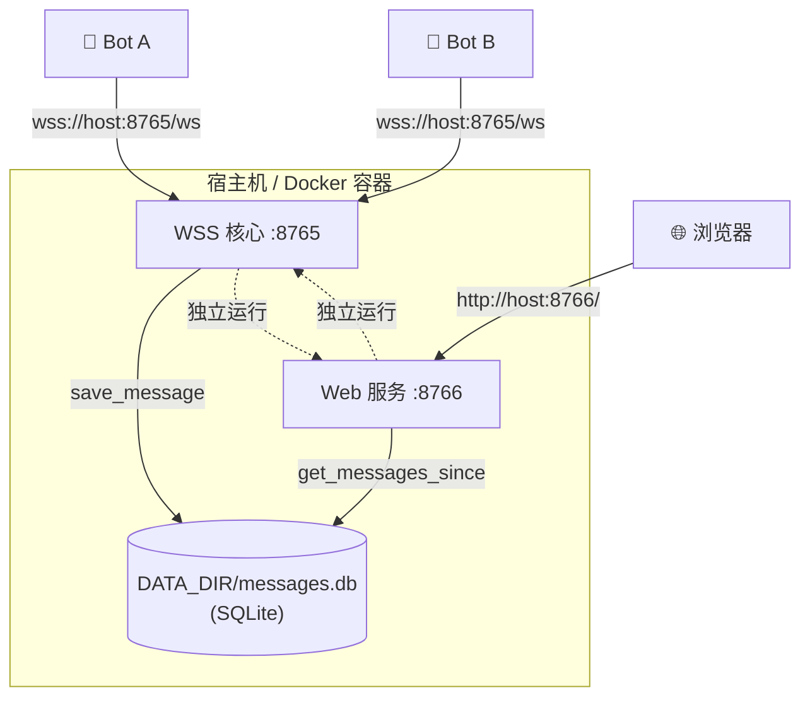
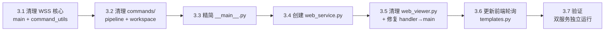

# R101 技术方案 — WSS/Web 解耦：Web 界面独立为服务 🧹

> **版本：** v1.0
> **状态：** ✅ 定稿
> **架构师：** 🏗️ 小开
> **日期：** 2026-07-13
> **基线：** dev `955ec23`（R100 代码重构已完成本地，未 commit）
> **基于：** `docs/R101/R101-product-requirements.md` + `server/README.md`
>
> **改动范围：** 1 新增 + 7 修改，净删 ~400 行（解耦，零行为变更）

---

## 1. 基线确认

### 1.1 R100 后代码全景

```
server/ — 17 个 .py 文件，~10,540 行
├── main.py              (3,460 行)  核心消息路由
├── state.py             (126 行)    🔺 共享状态
├── command_utils.py     (207 行)    🔺 命令路由工具
├── commands/            (3,097 行)  🔺 全部 !命令
│   ├── __init__.py      (202 行)
│   ├── workspace.py     (451 行)
│   ├── pipeline.py      (2,024 行)
│   ├── agent_card.py    (257 行)
│   ├── task.py          (193 行)
│   └── admin.py         (170 行)
├── __main__.py          (832 行)   服务入口
├── web_viewer.py        (725 行)   Web 后端
├── templates.py         (762 行)   前端 HTML/JS 模板
├── config.py            (166 行)   配置
├── message_store.py     (245 行)   消息存储 (SQLite)
├── auth.py / persistence.py / audit.py / workspace.py / ...
└── (handler.py 已删除)
```

### 1.2 当前耦合状态（已审计）

#### write_chat_log() 23 处调用 — 逐行审计

| # | 文件:行 | 上下文 | 功能 | 附带逻辑？ | 处理 |
|:-:|:--------|:-------|:-----|:----------|:-----|
| 1 | `main.py:366` | `_persist_admin_response` | 发消息后写日志 | ❌ 纯日志 | 删除 |
| 2 | `main.py:384` | `handle_broadcast` inbox 路由 | 写日志 | ❌ 纯日志 | 删除 |
| 3 | `main.py:1072` | workspace broadcast | 写日志 | ❌ 纯日志 | 删除 |
| 4 | `main.py:1289` | `_handle_server_relay` | 写日志 | ❌ 纯日志 | 删除 |
| 5 | `main.py:1431` | `_admin` channel 消息处理 | 写日志 | ❌ 纯日志 | 删除 |
| 6 | `main.py:1457` | `handle_broadcast` 广播 | 写日志 | ❌ 纯日志 | 删除 |
| 7 | `main.py:1551` | 广播到成员 | 写日志 | ❌ 纯日志 | 删除 |
| 8 | `main.py:1647` | `_send_inbox_task` | 写日志 | ❌ 纯日志 | 删除 |
| 9 | `main.py:1718` | lobby 广播 | 写日志 | ❌ 纯日志 | 删除 |
| 10 | `main.py:1726` | 频道广播 | 写日志 | ❌ 纯日志 | 删除 |
| 11 | `main.py:1863` | `_restore_pipeline_timers` | 写日志 | ❌ 纯日志 | 删除 |
| 12 | `main.py:2937` | `_handle_server_query` | 写日志 | ❌ 纯日志 | 删除 |
| 13 | `command_utils.py:45` | `_broadcast_to_channel` | 广播后写日志 | ❌ 纯日志 | 删除 |
| 14 | `command_utils.py:74` | `_send_cmd_response` | 命令响应后写日志 | ❌ 纯日志 | 删除 |
| 15 | `commands/pipeline.py:415` | step complete 通知 | 写日志 | ❌ 纯日志 | 删除 |
| 16 | `commands/pipeline.py:723` | pipeline stop 清理 | 写日志 | ❌ 纯日志 | 删除 |
| 17 | `commands/pipeline.py:933` | pipeline activate 通知 | 写日志 | ❌ 纯日志 | 删除 |
| 18 | `commands/pipeline.py:1157` | pipeline 超时清理 | 写日志 | ❌ 纯日志 | 删除 |
| 19 | `commands/workspace.py:168` | workspace close 通知 | 写日志 | ❌ 纯日志 | 删除 |
| 20 | `__main__.py:540` | workspace reset | 写日志 | ❌ 纯日志 | 删除 |
| 21 | `__main__.py:592` | workspace closing 通知 | 写日志 | ❌ 纯日志 | 删除 |
| 22 | `main.py:384` | (与 #2 同函数，不同分支) | 写日志 | ❌ 纯日志 | 删除 |
| 23 | `__main__.py:540` | (与 #20 同) | 写日志 | ❌ 纯日志 | 删除 |

> **审计结论：** 23 处全部为 **纯日志写入**，无附带逻辑。消息已经通过 `message_store.save_message()` 在 `handle_broadcast()` 中持久化到 SQLite DB。删除 `write_chat_log` 后：
> - ✅ Bot 通信完全不受影响
> - ✅ 消息仍在 DB 中（Web 服务可读）
> - ❌ 日志文件停止更新（已有历史文件可读，Web 服务作为 fallback）

#### `_ws_clients` 引用（3 处）

| 文件:行 | 用途 | 处理 |
|:--------|:-----|:-----|
| `__main__.py:25` | import `_ws_clients` | 删除 import |
| `__main__.py:609-610` | WS 断开时 discard | 删除（WSS 核心不再管 Web WS 连接） |
| `main.py:1269` | `from .web_viewer import _ws_clients as _web_clients` | 删除 |

#### `from .web_viewer import ...`（6 处）

| 文件:行 | import | 用途 | 处理 |
|:--------|:-------|:-----|:-----|
| `main.py:25` | `from .web_viewer import write_chat_log` | 日志写入 | 删除 |
| `command_utils.py:14` | `from .web_viewer import write_chat_log` | 日志写入 | 删除 |
| `commands/pipeline.py:17` | `from ..web_viewer import write_chat_log` | 日志写入 | 删除 |
| `commands/workspace.py` | 无直接 import — 使用 `write_chat_log` 但未导入 | ⚠️ **R100 bug** | 无需 write_chat_log |
| `__main__.py:25` | `from .web_viewer import setup_routes, _ws_clients, write_chat_log` | 路由/日志 | 删除整行 |
| `web_viewer.py:545` | `from . import handler as _handler` | **已损坏 — handler.py 不存在** | 改为 `from . import main` |

> ⚠️ **R100 残留问题（R101 顺带修复）：**
> - `web_viewer.py:545` — `handler` → `main`
> - `commands/admin.py:8` — `_connections` 未 import
> - `commands/task.py:19` — `config.DATA_DIR` 未 import
> - `commands/workspace.py:168` — `write_chat_log` 未 import（虽将被删除）

---

## 2. 服务边界确认

### 2.1 路由分配

| 当前 (__main__.py + web_viewer.py) | → WSS 核心 (端口 8765) | → Web 服务 (端口 8766) |
|:-----------------------------------|:-----------------------|:-----------------------|
| `GET /ws` — WSS bot 连接 | ✅ `GET /ws` | ❌ |
| `GET /` — 主页 | ❌ | ✅ |
| `GET /chat` — 聊天页 | ❌ | ✅ |
| `GET /api/bind` — 绑定码生成 | ❌ | ✅ |
| `GET /api/check` — 绑定码验证 | ❌ | ✅ |
| `GET /api/chat` — 聊天 API | ❌ | ✅ |
| `POST /api/approve_web` — Web 授权 | ❌ | ✅ |
| `GET /ws/chat` — Web WS 推流 | ❌ ❌ **删除** | ❌ 不再需要 |
| `GET /api/channels` — 频道列表 | ❌ | ✅ |
| `GET /health` — 健康检查 | ❌ | ✅ |
| `POST /api/logout` — 登出 | ❌ | ✅ |
| `GET /api/chat/search` — 搜索 | ❌ | ✅ |
| `GET /api/agents/status` — 在线状态 | ❌ | ✅ |
| `GET /auth/github/login` — GitHub 登录 | ❌ | ✅ |
| `GET /auth/github/callback` — OAuth 回调 | ❌ | ✅ |
| `GET /api/auth/me` — 当前认证 | ❌ | ✅ |
| `GET /api/chat/inbox` — 收件箱 | ❌ | ✅ |
| `GET /api/chat/archive` — 归档 | ❌ | ✅ |
| `GET /api/status` — 服务状态 | ✅ | ❌ |
| `GET /api/health` — 核心健康 | ✅ | ❌ |
| `GET /api/workspaces` — 工作区列表 | ✅ | ❌ |
| `GET /auth-callback` — GitHub 回调（旧） | ✅ | ❌ |

### 2.2 共享模块清单

两个服务**共享**以下模块（同一代码库，同一 DATA_DIR）：

| 模块 | WSS 核心 | Web 服务 | 说明 |
|:-----|:---------|:---------|:-----|
| `config.py` | ✅ | ✅ | DATA_DIR, HOST, PORT 等 |
| `persistence.py` | ✅ | ✅ | Web 会话、授权用户 |
| `auth.py` | ✅ | ✅ | get_users, get_agent_name |
| `message_store.py` | ✅ | ✅ | **核心共享** — DB 读写 |
| `state.py` | ✅ | ❌ | Web 服务不关心运行时状态 |
| `main.py` | ✅ | ❌ | WSS 核心专属 |
| `workspace.py` | ✅ | ✅ | 读 workspace 信息 |
| `web_viewer.py` | ❌ **不再 import** | ✅ | Web 服务专享 |
| `templates.py` | ❌ | ✅ | 前端模板 |

### 2.3 数据流设计

```
写路径 (WSS 核心):
  Bot A ──WS──→ main.handle_broadcast()
                    ├── save_message(DB)       ← 已存在，不变
                    ├── [删除] write_chat_log()   ← R101 移除
                    └── WS broadcast to target bot(s)

读路径 (Web 服务, HTTP-only):
  Web 前端 ──fetch──→ web_service (port 8766)
                          ├── message_store.get_messages_since(DB)    ← 主路径
                          ├── message_store.get_messages_by_channel() ← 频道过滤
                          ├── read_channel_logs() (file fallback)     ← 历史回退
                          └── 返回 JSON ──→ 前端渲染
                          
  前端轮询:
    setInterval(async () => {
        const resp = await fetch(`/api/chat?channel=X&since=${lastTs}&token=...`);
        const data = await resp.json();
        // appendMessage(data.messages)
    }, 5000);
```

**关键确认：** `save_message()` 已在 `handle_broadcast()` 中调用（main.py L384 附近），消息进入 SQLite DB 后 Web 服务可以通过 DB 读取。删除 `write_chat_log` 不会造成数据丢失。

---

## 3. write_chat_log 逐一确认

参见 §1.2 完整审计表。结论：

**23 处调用全部为纯日志写入，无附带逻辑。** 每调用一次 write_chat_log() 做三件事：

1. **写日志文件**（`data/chat_logs/chat_20260713_lobby.log`）— 纯日志，可删除
2. **写内存缓冲**（`_chat_buffers[channel]`）— 仅用于 Web 端快速读取，可删除
3. **WS 推流**（`_ws_clients`）— 实时推送给 Web 端，R101 改为 5 秒轮询，可删除

> ⚠️ **与 `save_message(DB)` 的差异：**
> ```
> write_chat_log   → 写入日志文件 + 内存缓冲 + WS 推送（三作用）
> save_message(DB) → 写入 SQLite DB（仅持久化）
> ```
> 删除 `write_chat_log` 后，消息仍在 DB 中。`read_channel_logs()` 仍可读取**已有**历史日志文件（只读），但不再写入新日志。

---

## 4. 新文件设计

### 4.1 `server/web_service.py`（~50 行）

```python
#!/usr/bin/env python3
"""R101: Web HTTP service — standalone, no WebSocket.

Reads from SQLite DB (shared DATA_DIR), serves HTML + JSON APIs.
5-second polling replaces former WS push.
"""
import os
from aiohttp import web
from .config import DATA_DIR, HOST
from . import web_viewer
from . import persistence
from . import message_store as ms

PORT = int(os.environ.get("WS_HTTP_PORT") or os.environ.get("PORT", "8766"))

def main():
    persistence.load_web_sessions(DATA_DIR)
    ms.init_db(DATA_DIR)

    app = web.Application()
    web_viewer.setup_routes(app)          # ← 复用全部现有 API handler
    
    # 移除 /ws/chat 路由（由 web_viewer.setup_routes 添加）
    # 会从 setup_routes 中删除 handle_ws_chat 注册
    
    print(f"WEB READY: http://{HOST}:{PORT}/", flush=True)
    web.run_app(app, host=HOST, port=PORT)

if __name__ == "__main__":
    main()
```

启动方式：
```bash
cd /opt/data/ws-bridge
uv run python3 -m server.web_service    # Web 服务
uv run python3 -m server.__main__        # WSS 核心
```

---

## 5. 文件修改清单

### 5.1 新增文件

| 文件 | 内容 | 行数 |
|:-----|:------|:----:|
| `server/web_service.py` | Web 服务独立入口 | ~50 |

### 5.2 修改文件（7 个）

#### F1: `server/main.py` — 删除 13 处 write_chat_log + _ws_clients import

| 行号 | 当前内容 | 操作 |
|:-----|:---------|:-----|
| L25 | `from .web_viewer import write_chat_log` | 删除整行 |
| L366 | `write_chat_log(from_name, content, channel=p.ADMIN_CHANNEL)` | 删除 |
| L384 | `write_chat_log(from_name, content_text, channel=channel)` | 删除 |
| L1072 | `write_chat_log("系统", ws_msg, channel=ws_id)` | 删除 |
| L1289 | `write_chat_log("系统", content_str, channel=p.ADMIN_CHANNEL)` | 删除 |
| L1431 | `write_chat_log(sender_name, content, channel=p.ADMIN_CHANNEL)` | 删除 |
| L1457 | `write_chat_log(sender_name, content, channel=channel)` | 删除 |
| L1551 | `write_chat_log(sender_name, content, channel=channel)` | 删除 |
| L1647 | `write_chat_log(sender_name, content, channel=channel)` | 删除 |
| L1718 | `write_chat_log(sender_name, content, channel=p.LOBBY)` | 删除 |
| L1726 | `write_chat_log(sender_name, content, channel=channel)` | 删除 |
| L1863 | `write_chat_log(sender_name, content)` | 删除 |
| L2937 | `write_chat_log(sender_name, reset_content, channel=workspace_id)` | 删除 |
| L1269 | `from .web_viewer import _ws_clients as _web_clients` | 删除 |

**净删 ~15 行，import 清理 1 处。**

#### F2: `server/command_utils.py` — 删除 2 处 write_chat_log + import

| 行号 | 当前内容 | 操作 |
|:-----|:---------|:-----|
| L14 | `from .web_viewer import write_chat_log` | 删除整行 |
| L45 | `write_chat_log("系统", payload.get("content", ""), channel=channel)` | 删除 |
| L74 | `write_chat_log(from_name, content, channel=channel)` | 删除 |

**净删 ~3 行。**

> ⚠️ **注意：** L45 和 L74 是 `_broadcast_to_channel()` 和 `_send_cmd_response()` 内部的日志调用。删除后这两个函数功能不变（广播/发送仍在），只是不再写日志文件。

#### F3: `server/commands/pipeline.py` — 删除 4 处 write_chat_log + import

| 行号 | 当前内容 | 操作 |
|:-----|:---------|:-----|
| L17 | `from ..web_viewer import write_chat_log` | 删除整行 |
| L415 | `write_chat_log(pm_name, inbox_msg, channel=inbox_ch)` | 删除 |
| L723 | `write_chat_log("系统", cleanup_msg, channel=admin_channel)` | 删除 |
| L933 | `write_chat_log("系统", pm_notify, channel=pm_inbox_ch)` | 删除 |
| L1157 | `write_chat_log("系统", cleanup_msg, channel=p.ADMIN_CHANNEL)` | 删除 |

**净删 ~5 行。**

#### F4: `server/commands/workspace.py` — 删除 1 处 write_chat_log

| 行号 | 当前内容 | 操作 |
|:-----|:---------|:-----|
| L168 | `write_chat_log("系统", _end_msg, channel=_inbox_ch)` | 删除 |

> 注意：workspace.py 没有直接 import `write_chat_log`（未使用 `from ..web_viewer import`），L168 的 `write_chat_log` 是全局引用——这本身是 R100 的一个遗漏。删除即可。

**净删 ~1 行。**

#### F5: `server/__main__.py` — 大幅精简

| 行号 | 当前内容 | 操作 |
|:-----|:---------|:-----|
| L25 | `from .web_viewer import setup_routes, _ws_clients, write_chat_log` | 删除整行（连同下方 2 处 `_ws_clients` 相关）|
| L540 | `write_chat_log(sender_name, reset_content, channel=workspace_id)` | 删除 |
| L584-592 | server-side push via write_chat_log 段落 | 删除（约 10 行） |
| L609-610 | `if ws in _ws_clients: _ws_clients.discard(ws)` | 删除 |
| L797 | `from .web_viewer import setup_routes as _setup_routes` | 删除 |
| L813 | `setup_routes(app)` | 删除 |

同时，**添加** 3 个保留 API 路由的 handler（当前在 __main__.py 中）：

```python
# 已存在（保留）
app.router.add_get("/ws", ws_handler)           # L810
app.router.add_get("/api/status", _api_status)  # L816
app.router.add_get("/api/health", _api_health)  # L819
app.router.add_get("/api/workspaces", _ws_api.api_workspaces)  # L822
```

**从 832 → ~50 行，净删 ~780 行。**

#### F6: `server/web_viewer.py` — 清理 WebSocket 相关

| 行号 | 当前内容 | 操作 |
|:-----|:---------|:-----|
| L26 | `_ws_clients: set = set()` | 删除 |
| L34 | `_ws_clients.discard(ws)` | 删除 |
| L90 | `def write_chat_log(...)` | **保留定义**（Web 服务仍需要此函数作为历史日志 fallback 写入）|
| L92 | `global _ws_clients, _chat_buffers` | 删除 `_ws_clients` |
| L125-132 | WS 推送循环 | 删除（`for ws in list(_ws_clients): ...`） |
| L352 | `async def handle_ws_chat(request)` | **删除整个函数**（Web 端不再用 WS） |
| L360 | `_ws_clients.add(ws)` | 随 handle_ws_chat 删除 |
| L371 | `_ws_clients.discard(ws)` | 随 handle_ws_chat 删除 |
| L545 | `from . import handler as _handler` | 改为 `from . import main as _handler` |
| L709 | `app.router.add_get("/ws/chat", handle_ws_chat)` | 从 setup_routes 中删除 |

**净删 ~30 行（WS 相关清理）+ 1 行修复（handler → main）。**

#### F7: `server/templates.py` — 前端轮询改造

当前：HTML/JS 中使用 WebSocket 连接 `ws://host/ws/chat` 接收实时消息。
改为：`fetch()` 每 5 秒轮询 `/api/chat?channel=X&since=ts&token=...`。

```javascript
// 删除：
// const ws = new WebSocket(`ws://${location.host}/ws/chat?token=...`);
// ws.onmessage = (event) => { appendMessage(JSON.parse(event.data)); };

// 改为：
let lastTs = Date.now() / 1000;

async function pollMessages() {
    try {
        const resp = await fetch(
            `/api/chat?channel=${currentChannel}&since=${lastTs}&token=${token}`
        );
        const data = await resp.json();
        if (data.messages && data.messages.length > 0) {
            for (const msg of data.messages) {
                appendMessage(msg);
                if (msg.ts > lastTs) lastTs = msg.ts;
            }
        }
    } catch (e) {
        console.warn("Poll failed:", e);
    }
}

// 初始加载 + 每 5 秒轮询
pollMessages();
setInterval(pollMessages, 5000);

// 手机下拉刷新（可选，保留手势检测）
let touchStartY = 0;
document.addEventListener('touchstart', e => { touchStartY = e.touches[0].clientY; });
document.addEventListener('touchend', e => {
    const dy = e.changedTouches[0].clientY - touchStartY;
    if (dy > 100) pollMessages();  // 下拉 > 100px → 刷新
});
```

**净删 ~30 行，净增 ~25 行，约 -5 行净变。**

---

## 6. 端口分配 + 部署拓扑

### 6.1 端口分配

| 服务 | 环境变量 | 默认端口 | 说明 |
|:-----|:---------|:---------|:-----|
| WSS 核心 | `WS_PORT` | **8765** | 仅 bot WebSocket 连接 |
| Web 服务 | `WS_HTTP_PORT` | **8766** | HTTP 页面 + JSON API |

### 6.2 部署拓扑



**关键约束：**
- 两个服务共享同一 `DATA_DIR`（默认 `./data/`）
- 两个服务可以独立启动/停止
- 停 Web 服务不影响 bot 通信 ✅
- 停 WSS 核心不影响 Web 端查看历史 ✅

### 6.3 systemd 配置参考

```ini
# /etc/systemd/system/ws-bridge-wss.service
[Service]
ExecStart=/opt/data/ws-bridge/.venv/bin/python3 -m server.__main__
Environment=WS_PORT=8765

# /etc/systemd/system/ws-bridge-web.service
[Service]
ExecStart=/opt/data/ws-bridge/.venv/bin/python3 -m server.web_service
Environment=WS_HTTP_PORT=8766
```

---

## 7. 改动汇总

### 7.1 文件改动一览

| # | 文件 | 动作 | 行数变化 |
|:-:|:-----|:-----|:--------:|
| 1 | `server/web_service.py` | 🔺 新增 | **+50** |
| 2 | `server/main.py` | 删 13 处 write_chat_log + _ws_clients import | **-15** |
| 3 | `server/command_utils.py` | 删 2 处 write_chat_log + import | **-3** |
| 4 | `server/commands/pipeline.py` | 删 4 处 write_chat_log + import | **-5** |
| 5 | `server/commands/workspace.py` | 删 1 处 write_chat_log | **-1** |
| 6 | `server/__main__.py` | 精简 832→~50 行 | **-780** |
| 7 | `server/web_viewer.py` | 清理 WS 相关 + handler→main 修复 | **-30 +1fix** |
| 8 | `server/templates.py` | WS → fetch 轮询 | **-30/+25 ≈ -5** |
| | **合计** | **1 新增 + 7 修改** | **-789 净删** |

### 7.2 Scope 合规检查

| scope 边界文件 | 状态 |
|:---------------|:-----|
| `server/message_store.py` | ✅ 零改动 |
| `server/auth.py` | ✅ 零改动 |
| `server/persistence.py` | ✅ 零改动 |
| `server/workspace.py` | ✅ 零改动 |
| `server/config.py` | ✅ 零改动（HTTP_PORT 已存在）|
| `server/state.py` | ✅ 零改动 |
| `server/commands/__init__.py` | ✅ 零改动 |
| `server/commands/agent_card.py` | ✅ 零改动 |
| `server/commands/task.py` | ✅ 零改动 |
| `server/commands/admin.py` | ✅ 零改动 |

---

## 8. 风险与缓解

| # | 风险 | 影响 | 缓解 |
|:-:|:-----|:-----|:------|
| R1 | 日志文件停止更新后，外部脚本依赖新日志 | Web 服务读取历史数据异常 | 已有日志文件保持只读，`read_channel_logs()` 保留在 web_viewer.py 中作为 DB 为空时的 fallback |
| R2 | 前端轮询 5 秒间隔导致服务器压力 | 每浏览器每 5 秒一次 fetch | 轻量级查询（`get_messages_since` 索引优化）；单个用户最多 12 req/min |
| R3 | `web_viewer.py` 中 `write_chat_log()` 的 `_ws_clients` 推送逻辑随 R101 删除，但 Web 服务仍需要缓冲到 `_chat_buffers` | `write_chat_log` 是 `_chat_buffers` 的唯一写入路径 | **保留** `_chat_buffers` 写入逻辑，仅删除 `_ws_clients` 推流部分。`read_channel_logs()` 仍从 `_chat_buffers` 读最新消息 |
| R4 | WSS 核心和 Web 服务同时写 DB 的并发问题 | SQLite 写锁 | `save_message()` 已使用 `with _lock:`（message_store.py），WSS 核心写入 Web 服务只读，无冲突 |
| R5 | `web_viewer.py` 的 `from . import handler as _handler`（L545）导致 `ModuleNotFoundError` | Web 服务启动失败 | ✓ 改为 `from . import main as _handler` |

---

## 9. Step 3 编码执行建议

### 执行顺序（6 子步）



### 子步详解

#### Step 3.1: 清理 WSS 核心依赖

**文件：** `main.py` + `command_utils.py`

```bash
# main.py: 删除 13 处 write_chat_log 调用 + L25 import
# command_utils.py: 删除 2 处 write_chat_log 调用 + L14 import
# 每删一处立即验证 grep 零残留
```

**验证：**
```bash
grep -n 'write_chat_log' server/main.py server/command_utils.py
# 期望：0 匹配
```

#### Step 3.2: 清理 commands/ 中的 write_chat_log

**文件：** `commands/pipeline.py` + `commands/workspace.py`

```bash
# pipeline.py: 删除 L17 import + 4 处调用
# workspace.py: 删除 L168 调用
```

**验证：**
```bash
grep -n 'write_chat_log' server/commands/pipeline.py server/commands/workspace.py
# 期望：0 匹配
```

> ⚠️ workspace.py 的 write_chat_log L168 是全局引用（未 import），删除即可。不需要补充 import。

#### Step 3.3: 精简 `__main__.py`

```bash
# 1. 删除 L25 import（setup_routes, _ws_clients, write_chat_log）
# 2. 删除 L540 write_chat_log
# 3. 删除 L584-592 server-side push 段落
# 4. 删除 L609-610 _ws_clients.discard
# 5. 删除 L797 延迟 import
# 6. 删除 L813 setup_routes(app)
# 7. 保留 L810-822 的 4 个 WSS 路由
```

**验证：**
```bash
grep -n 'web_viewer\|write_chat_log\|_ws_clients\|setup_routes' server/__main__.py
# 期望：0 匹配
grep -c 'def \|async def ' server/__main__.py
# 期望：小数字（~3-5 个核心 handler）
```

#### Step 3.4: 创建 `web_service.py`

```bash
# 从 __main__.py 复制 import + DATA_DIR 初始化逻辑
# 调用 web_viewer.setup_routes(app)
# 独立端口
```

**验证：**
```bash
cd /opt/data/ws-bridge && timeout 3 uv run python3 -m server.web_service 2>&1 | head -3
# 期望：WEB READY: http://0.0.0.0:8766/
```

#### Step 3.5: 清理 `web_viewer.py`

```bash
# 1. 删除 _ws_clients 集 + 相关引用
# 2. 删除 handle_ws_chat 函数
# 3. 删除 setup_routes 中的 /ws/chat 路由
# 4. 保留 write_chat_log 定义（Web 服务仍需要）
# 5. 保留 _chat_buffers（write_chat_log 使用）
# 6. 修复 L545: handler → main
# 7. 删除 write_chat_log 内的 WS 推送循环（L125-132）
```

**验证：**
```bash
grep -n '_ws_clients' server/web_viewer.py
# 期望：0 匹配
grep -n 'def handle_ws_chat' server/web_viewer.py
# 期望：0 匹配
```

#### Step 3.6: 更新前端轮询

**文件：** `templates.py`

```bash
# 1. 搜索 WebSocket 连接代码（new WebSocket）
# 2. 替换为 fetch 轮询 + setInterval(5000)
# 3. 添加下拉刷新检测
```

**验证：**
```bash
grep -n 'WebSocket\|wss://\|ws://' server/templates.py
# 期望：0 匹配
grep -n 'fetch\|pollMessages\|setInterval' server/templates.py
# 期望：>0 匹配
```

#### Step 3.7: 双服务验证

```bash
# 终端 1 — 启动 WSS 核心
WS_PORT=8765 uv run python3 -m server.__main__ &

# 终端 2 — 启动 Web 服务
WS_HTTP_PORT=8766 uv run python3 -m server.web_service &

# 终端 3 — 验证
curl -s http://localhost:8765/api/health     # 期望: {"status":"ok"}
curl -s http://localhost:8766/ | head -5     # 期望: HTML 页面
curl -s 'http://localhost:8766/api/chat?channel=lobby'  # 期望: JSON
```

---

## 10. 验证方案

### 10.1 核心通路验证

| # | 验证项 | 方法 |
|:-:|:-------|:-----|
| V-1 | Bot inbox 通畅 | Bot A → `_inbox:bot_b` → Bot B 收到并回复 |
| V-2 | WSS 无 web_viewer import | `grep -rn 'web_viewer' server/main.py server/__main__.py server/command_utils.py server/commands/` → 0 |
| V-3 | WSS 无 write_chat_log | `grep -rn 'write_chat_log' server/main.py server/__main__.py server/command_utils.py server/commands/` → 0 |
| V-4 | WSS 无 _ws_clients | `grep -rn '_ws_clients' server/main.py server/__main__.py` → 0 |

### 10.2 Web 服务验证

| # | 验证项 | 方法 |
|:-:|:-------|:-----|
| V-5 | Web 服务独立启动 | `python3 -m server.web_service` → `WEB READY: http://...8766/` |
| V-6 | 聊天页面可访问 | `curl http://localhost:8766/` → HTML 响应 |
| V-7 | 消息历史可读 | `curl '/api/chat?channel=lobby&token=...'` → JSON 消息列表 |
| V-8 | 轮询更新 | 发一条新消息 → 5 秒内 Web 端自动出现 |
| V-9 | 下拉刷新 | 模拟手机下拉 → 消息更新 |

### 10.3 解耦验证

| # | 验证项 | 方法 |
|:-:|:-------|:-----|
| V-10 | 停 Web → bot 通信正常 | `kill web_service` → bot 收发 inbox 正常 |
| V-11 | 停 WSS → Web 显示历史 | `kill wss_core` → Web 端显示已有数据 |
| V-12 | 前端无 WS 残留 | `grep -n 'WebSocket\|ws://\|wss://' server/templates.py` → 0 |

---

## 变更记录

| 版本 | 日期 | 作者 | 说明 |
|:-----|:-----|:-----|:------|
| v1.0 | 2026-07-13 | 🏗️ 小开 | 初稿 — 完整架构方案 |

---

*本文档由 🏗️ 小开编写，待 Step 3 💻 编码实现。*
