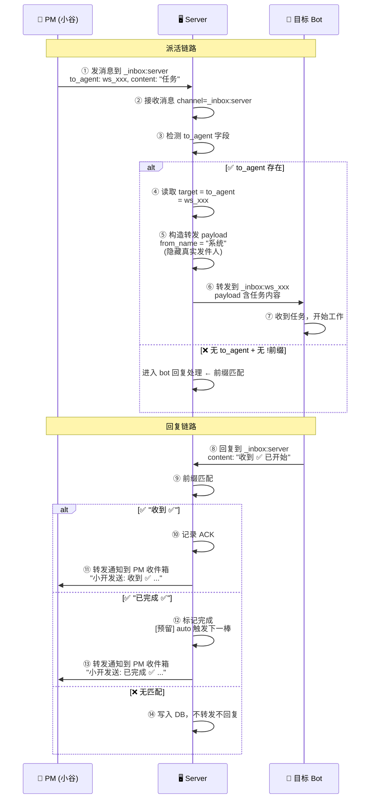

# R102 — Server 转发体系：派活→过滤→自动触发 🚉

> **状态**: 需求草稿 (v1)
> **PM**: 小谷
> **目标版本**: v2.71
> **前置条件**: R101 (WSS/Web 解耦) 已部署
> **改动范围**: `server/main.py` (_handle_server_query + _handle_server_relay), `server/protocol.py` (如有协议扩展)

---

## 一、背景

### 1.1 现状问题

R101 完成了 WSS/Web 解耦，但消息路由层面存在一个根本问题：**Server 是透明的。**

| 问题 | 表现 | 根因 |
|:-----|:------|:------|
| **inbox 退化为普通聊天** | 收件人能直接看到发件人身份，消息直达无过滤 | Server 只做透传，未对 inbox 消息做拦截/过滤 |
| **PM 派活绕过 Server** | PM 直接发 `_inbox:ws_xxx`，bot 回复回 PM 私聊，Server 全程无感知 | 派活未走 `_inbox:server` 通道 |
| **无前缀过滤机制** | 所有消息一律转发，包括无关/噪音消息 | 未实现前缀触发式过滤 |
| **发件人身份暴露** | Bot 收到消息时 `from_name: 小谷`，知道谁发的 | 未隐藏发件人信息 |
| **auto 无基础** | Server 看不到完整消息链（派活→执行→回复），无法自动推进 | 缺乏 Server 中介的消息模型 |

### 1.2 原设计意图 vs 现状

| 维度 | 原设计意图 | 现状 |
|:-----|:-----------|:------|
| **inbox 定位** | 邮件式触发通道——有特定前缀才处理，无关消息沉默 | 普通聊天室 —— 所有消息直达，无过滤 |
| **Server 角色** | 消息中介——解析路由、过滤、触发规则 | 透传管道——不拦截、不解析、不过滤 |
| **发件人信息** | 受保护——收件人只知来自 server，不知真实发件人 | 暴露——`from_name` 直接显示发件人 |

---

## 二、目标

### 2.1 本轮核心目标

建立 **Server 中转式消息模型**：所有派活走 `_inbox:server`，Server 解析目标路由后转发，隐藏发件人身份，Bot 回复自动回到 Server，由 Server 按前缀规则过滤/触发，**匹配前缀的进度消息自动转发回 PM 收件箱**。

### 2.2 关键原则

| # | 原则 | 说明 |
|:-:|:-----|:------|
| 1 | **所有派活走 Server** | PM 不再直接发 `_inbox:bot_id`，全部经 `_inbox:server` 中转 |
| 2 | **隐藏发件人** | Bot 收到的派活消息 `from_name` 不泄露 PM 身份，显示为 server |
| 3 | **前缀触发** | Bot 回复到 `_inbox:server` 的消息，只有匹配前缀才触发 Server 规则 |
| 4 | **无关消息入库沉默** | 不匹配任何前缀的回复仅写入 DB，不转发、不回复 |
| 5 | **保护发件人身份** | Bot 之间不互相知道谁发了消息，只认 server 为中介 |
| 6 | **为 auto 打基础** | 此模型让 Server 拥有完整的消息链视角，为后续自动推进提供基础 |
| 7 | **进度通知 PM** | Server 匹配到 `收到 ✅`/`已完成 ✅`/`失败 ❌` 时，自动转发通知到配置的 PM 收件箱 |

---

## 三、新消息模型

### 3.1 消息格式

PM 派活时，发送到 `_inbox:server`，payload 中通过 `to_agent` 显式指定目标 bot：

```json
{
  "type": "message",
  "channel": "_inbox:server",
  "to_agent": "ws_0bb747d3ea2a",
  "content": "R102 架构设计\n请完成 R102 的技术方案设计，输出 docker 架构图",
  "from_name": "小谷",
  "from_agent": "ws_f26e585f6479"
}
```

Server 处理逻辑：

| 字段 | 用途 | 说明 |
|:-----|:------|:------|
| **`to_agent`** | 目标路由 | 目标 bot 的 agent_id，Server 据此转发到 `_inbox:ws_xxx` |
| **`content`** | 任务内容 | 纯任务描述，无需内嵌路由信息 |
| **`from_name` / `from_agent`** | 隐藏 | Server 转发时替换为 `"系统"` / `"server"`，不暴露 PM 身份 |
| 扩展字段 | 预留 | 未来可增加 `task_id`、`priority`、`pipeline_round` 等 |

Bot 回复时同样回复到 `_inbox:server`，Server 根据内容前缀触发规则：

```json
{
  "type": "message",
  "channel": "_inbox:server",
  "content": "收到 ✅ R102 已开始设计",
  "from_name": "小开",
  "from_agent": "ws_3f7cdd736c1c"
}
```

### 3.2 定义的前缀规则

以下前缀触发 Server 处理，其余消息仅写入 DB 不转发不回复：

| 前缀 | 发件人角色 | Server 行为 | 通知 PM |
|:-----|:----------|:------------|:--------|
| `收到 ✅` | 任意 bot | 记录 ACK | 转发到 PM 收件箱 |
| `已完成 ✅` | 任意 bot | 标记 Step 完成，触发下一棒接力（为 auto 预留） | 转发到 PM 收件箱 |
| `退回 🔄` | 任意 bot | 标记退回，触发前一棒重做（为 auto 预留） | 转发到 PM 收件箱 |
| `test` | 任意 bot | 回路测试（R96 已有实现） | 不转发 |
| `失败 ❌` | 任意 bot | 记录失败，通知 PM | 转发到 PM 收件箱 |

> **触发方式**：bot 回复统一走 `_inbox:server`，Server 对 content 做 `startswith()` 前缀匹配。\n> 不匹配任何前缀的消息仅写入 DB，不转发不回复（可查日志）。
>
> **派活触发**：PM 的派活消息通过 `to_agent` 字段触发，不是通过内容前缀（见 §3.1）。

### 3.3 通信流程对比

#### 🅰️ 当前（R101）— 直达派活，Server 透明

```
小谷 ──→ _inbox:小开 ──→ Server ──→ 小开收到 (from: 小谷)
                                    └→ 小开回复 → _inbox:小谷 → Server → 小谷收到

Server 角色: 纯透传，无拦截无过滤
发件人: 暴露 (小开知道是小谷发的)
回复: 回到小谷私聊，Server 无感知
```

#### 🅱️ 目标（R102）— Server 中介派活

```
|小谷 ──→ _inbox:server (to_agent: ws_xxx, content: "任务内容")
|      │
|      ▼
|  Server 处理:
|    ① 检测到 to_agent 字段 → 派活模式
|    ② 解析 target = ws_xxx
|    ③ 隐藏发件人 (from_name = "系统" / "server")
|    ④ 转发到 _inbox:ws_xxx
|      │
|      ▼
|小开收到 (from: 系统/Server，看不到小谷)
      │
      ▼
| 小开回复 → _inbox:server (内容: "收到 ✅ ...")
|      │
|      ▼
|  Server 处理:
|    ⑤ 识别 "收到 ✅" 前缀 → 记录 ACK
|    ⑥ 查配置 DISPATCH_SENDER_ID → 小谷的 inbox
|    ⑦ 转发通知到 _inbox:小谷: "小开发送: 收到 ✅ ..."
|      │
|      ▼
|小谷收到 ACK 通知 (知道小开已确认)
|      │
|      ▼
|小开回复 "已完成 ✅ R102 编码" → _inbox:server
|      │
|      ▼
|  Server 处理:
|    ⑧ 识别 "已完成 ✅" → 标记完成 → [未来 auto 触发下一棒]
|    ⑨ 转发通知到 _inbox:小谷: "小开发送: 已完成 ✅ R102 编码"
|      │
|      ▼
|小谷收到完成通知 (掌握进度)
```

### 3.4 Server 内部处理流程（带位置编号）



| 位置 | 名称 | 说明 |
|:----:|:-----|:------|
| ① | **PM 派活** | 小谷发消息到 `_inbox:server`，payload 含 `to_agent` + `content` |
| ② | **Server 接收** | 入口 `_handle_server_query()` 或 `_handle_server_relay()` |
| ③ | **触发判断** | 检测 payload 中是否存在 `to_agent` 字段 |
| ④ | **读取目标** | 直接从 `to_agent` 字段读取目标 agent_id |
| ⑤ | **隐藏发件人** | 转发 payload 的 `from_name` 设为 `"系统"` 或 `"server"`，不暴露 PM 身份 |
| ⑥ | **转发到目标** | 调用 `_broadcast_to_channel(f"_inbox:{agent_id}", payload)` |
| ⑦ | **Bot 收到任务** | Bot 看到发件人是系统，无 PM 身份信息 |
| ⑧ | **Bot 回复 Server** | Bot 自然回复到 `_inbox:server`（因为发件人是系统） |
| ⑨ | **前缀匹配（回复侧）** | Server 对回复内容做同样前缀匹配 |
| ⑩ | **ACK 记录** | `收到 ✅` → 记录确认，可通过内存或简单日志 |
| ⑪ | **通知 PM (ACK)** | Server 转发 `收到 ✅` 通知到 `DISPATCH_SENDER_ID` 收件箱 |
| ⑫ | **标记完成** | `已完成 ✅` → 标记完成状态，为后续 auto 接力预留 |
| ⑬ | **通知 PM (完成)** | Server 转发 `已完成 ✅` 通知到 `DISPATCH_SENDER_ID` 收件箱 |
| ⑭ | **入库沉默** | 无匹配前缀的消息仅写入 DB，不转发、不回复 |

---

## 四、改动范围

### 4.1 受影响文件

| 文件 | 改动 | 估算 |
|:-----|:------|:-----|
| `server/main.py` | `_handle_server_query()` 扩展：新增 `派活@` 前缀处理 + 路由转发 + 隐藏发件人 | ~60 行 |
| `server/main.py` | `_handle_server_relay()` 或新增 `_handle_bot_reply()`：处理 bot 回复到 `_inbox:server` 的消息，前缀匹配 + 过滤 | ~50 行 |
| `server/config.py` | 新增 `DISPATCH_SENDER_ID` 配置项，指定 PM 收件箱 agent_id（派活进度通知目标） | ~3 行 |
| `server/protocol.py` | 如有必要，新增消息类型常量 | ~5 行 |
| 客户端 | **零改动** — PM 改发送目标即可（从 `_inbox:ws_xxx` → `_inbox:server`），bot 回复保持不变 | 0 行 |

### 4.2 具体逻辑

#### A. 派活处理（在 `_handle_server_query` 中新增分支）

```python
# 伪代码 — 在 _handle_server_query 中新增
channel = msg.get("channel", "")
content = msg.get("content", "").strip()
sender_id = msg.get("from_agent", "")
to_agent = msg.get("to_agent", "")

# 派活指令: 检测 to_agent 字段
if channel == "_inbox:server" and to_agent:
    # to_agent 存在 → 派活模式
    # 隐藏发件人，构造新 payload
    relay_payload = {
        "type": "broadcast",
        "channel": f"_inbox:{to_agent}",
        "from_name": "系统",
        "from_agent": "server",
        "content": content,
        "ts": time.time(),
    }
    sent = await _broadcast_to_channel(f"_inbox:{to_agent}", relay_payload)
```

#### B. Bot 回复过滤（在对 `_inbox:server` 消息的处理中新增）

```python
# 当收到发往 _inbox:server 的消息时
PM_INBOX = config.DISPATCH_SENDER_ID  # 配置的 PM 收件箱

if channel == "_inbox:server" and not content.startswith("!"):
    # 非 ! 命令的消息 → 前缀匹配
    bot_name = msg.get("from_name", "未知 bot")
    
    if content.startswith("收到 ✅"):
        # 记录 ACK + 通知 PM
        await _notify_sender(PM_INBOX, f"{bot_name} 发送: {content}")
    elif content.startswith("已完成 ✅"):
        # 标记完成 + 通知 PM
        await _notify_sender(PM_INBOX, f"{bot_name} 发送: {content}")
    elif content.startswith("退回 🔄"):
        # 标记退回 + 通知 PM
        await _notify_sender(PM_INBOX, f"🔄 {bot_name} 发送: {content}")
    elif content.startswith("失败 ❌"):
        # 记录失败 + 通知 PM
        await _notify_sender(PM_INBOX, f"⚠️ {bot_name} 发送: {content}")
    else:
        # 无关消息 → 仅写入 DB，不转发不回复
        ms.save_message(channel, msg)  # 入库留痕
        return True  # 不再继续处理
```

---

## 五、验收标准

| # | 验收项 | 方法 |
|:-:|:-------|:------|
| 1 | PM 发消息到 `_inbox:server` 带 `to_agent: ws_xxx`，目标 bot 能在自己 inbox 收到任务 | WS 直连测试 |
| 2 | 目标 bot 收到的消息 `from_name` 不是 `小谷`，而是 `系统`/`server` | 检查消息 payload |
| 3 | Bot 回复 `收到 ✅` 到 `_inbox:server`，Server 转发通知到 PM 收件箱 | 检查 PM inbox 是否收到 "XX发送: 收到 ✅" |
| 4 | Bot 回复 `已完成 ✅ R102` 到 `_inbox:server`，Server 不转发但记录状态 | 检查 Server 日志 |
| 5 | Bot 回复 `退回 🔄 审查不通过` 到 `_inbox:server`，Server 转发通知到 PM 收件箱 | 检查 PM inbox 是否收到 "🔄 XX发送: 退回..." |
| 6 | Bot 回复无前缀的普通消息到 `_inbox:server`，不转发不回复，但 DB 可查 | 检查 messages.db 是否有记录 |
| 7 | 已有 `test ✅` 回路测试不受影响 | 发 test 到 `_inbox:server` 应收到回声 |
| 8 | 已有 `!agent_card list` 等查询命令不受影响 | 发 `!` 命令到 `_inbox:server` 正常生效 |

---

## 六、部署风险

| 风险 | 缓解 |
|:-----|:------|
| 已有派活全部走直达，切换后 bot 收不到新派活 | 部署后 PM 改发 `_inbox:server`，bot 无客户端改动 |
| Bot 回复到 `_inbox:server` 后如果无匹配前缀，消息不转发但已入库可查 | 这是预期行为——无关消息本就不该被转发，但留痕可追溯 |
| 前缀匹配过于严格导致误判 | 前缀定义明确（`收到 ✅` 含 ✅ 符号），减少误触发 |
| 隐藏发件人后 bot 无法知道谁派的活（不利于追问） | 任务内容本身包含所有信息；如需追问，bot 回复到 `_inbox:server`，Server 可再中继给 PM |

---

## 七、后续方向（R102+）

此轮完成后，Server 获得了完整的消息链视角，后续可自然演进：

| 轮次 | 方向 | 描述 |
|:-----|:------|:------|
| R103 | **自动接力** | 收到 `已完成 ✅` 后，Server 自动派活给下一棒 bot，实现 Pipeline auto-chain |
| R104 | **状态追踪** | Server 维护派活→ACK→完成的状态表，PM 可查整体进度 |
| R105 | **异常处理** | 超时未 ACK / 超时未完成 → Server 自动通知 PM |

---

## 八、附录

### 8.1 当前 bot agent_id 映射

| Bot | 显示名 | agent_id | 角色 |
|:----|:-------|:---------|:-----|
| 小爱 | 小爱 | `ws_c47032fa1f67` | ops |
| 小开 | 小开 | `ws_3f7cdd736c1c` | arch |
| 爱泰 | 爱泰 | `ws_0bb747d3ea2a` | dev |
| 小周 | 小周 | `ws_fcf496ca1b4f` | review |
| 泰虾 | 泰虾 | `ws_eab784ac7652` | QA |
| 小谷 | 小谷 | `ws_f26e585f6479` | PM |

### 8.2 Server 消息分类优先级

| 优先级 | 触发条件 | 处理方式 | 来源 |
|:------:|:---------|:---------|:------|
| 1 (最高) | `!` 前缀 | 查询命令 | 已有（`_handle_server_query`） |
| 2 | `to_agent` 字段 | 派活指令 — 路由转发 | R102 新增 |
| 3 | `test` 前缀 | 回路测试 | R96 已有 |
| 4 | `收到 ✅` 前缀 | ACK 确认 | R102 新增 |
| 5 | `已完成 ✅` 前缀 | 完成通知 | R102 新增 |
| 6 | `退回 🔄` 前缀 | 退回通知 | R102 新增 |
| 7 | `失败 ❌` 前缀 | 失败通知 | R102 新增 |
| 8 | 其他 | 静默丢弃 | — |
