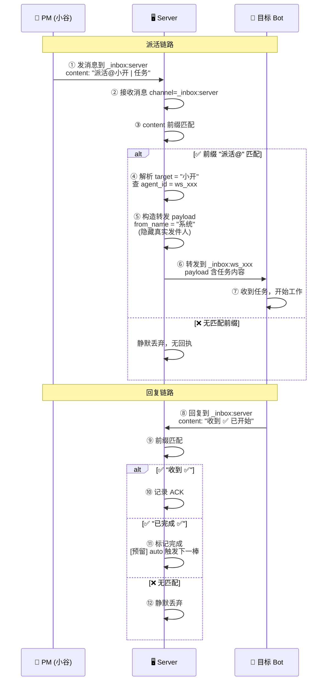

# R102 — Server 转发体系：派活→过滤→自动触发 🚉

> **状态**: 需求草稿 (v1)
> **PM**: 小谷
> **目标版本**: v2.71
> **前置条件**: R101 (WSS/Web 解耦) 已部署
> **改动范围**: `server/main.py` (_handle_server_query + _handle_server_relay), `server/protocol.py` (如有协议扩展)

---

## 一、背景

### 1.1 现状问题

R101 完成了 WSS/Web 解耦，但消息路由层面存在一个根本问题：**Server 是透明的。**

| 问题 | 表现 | 根因 |
|:-----|:------|:------|
| **inbox 退化为普通聊天** | 收件人能直接看到发件人身份，消息直达无过滤 | Server 只做透传，未对 inbox 消息做拦截/过滤 |
| **PM 派活绕过 Server** | PM 直接发 `_inbox:ws_xxx`，bot 回复回 PM 私聊，Server 全程无感知 | 派活未走 `_inbox:server` 通道 |
| **无前缀过滤机制** | 所有消息一律转发，包括无关/噪音消息 | 未实现前缀触发式过滤 |
| **发件人身份暴露** | Bot 收到消息时 `from_name: 小谷`，知道谁发的 | 未隐藏发件人信息 |
| **auto 无基础** | Server 看不到完整消息链（派活→执行→回复），无法自动推进 | 缺乏 Server 中介的消息模型 |

### 1.2 原设计意图 vs 现状

| 维度 | 原设计意图 | 现状 |
|:-----|:-----------|:------|
| **inbox 定位** | 邮件式触发通道——有特定前缀才处理，无关消息沉默 | 普通聊天室 —— 所有消息直达，无过滤 |
| **Server 角色** | 消息中介——解析路由、过滤、触发规则 | 透传管道——不拦截、不解析、不过滤 |
| **发件人信息** | 受保护——收件人只知来自 server，不知真实发件人 | 暴露——`from_name` 直接显示发件人 |

---

## 二、目标

### 2.1 本轮核心目标

建立 **Server 中转式消息模型**：所有派活走 `_inbox:server`，Server 解析目标路由后转发，隐藏发件人身份，Bot 回复自动回到 Server，由 Server 按前缀规则过滤/触发。

### 2.2 关键原则

| # | 原则 | 说明 |
|:-:|:-----|:------|
| 1 | **所有派活走 Server** | PM 不再直接发 `_inbox:bot_id`，全部经 `_inbox:server` 中转 |
| 2 | **隐藏发件人** | Bot 收到的派活消息 `from_name` 不泄露 PM 身份，显示为 server |
| 3 | **前缀触发** | Bot 回复到 `_inbox:server` 的消息，只有匹配前缀才触发 Server 规则 |
| 4 | **无关消息沉默** | 不匹配任何前缀的回复被静默丢弃，不给发件人任何回执 |
| 5 | **保护发件人身份** | Bot 之间不互相知道谁发了消息，只认 server 为中介 |
| 6 | **为 auto 打基础** | 此模型让 Server 拥有完整的消息链视角，为后续自动推进提供基础 |

---

## 三、新消息模型

### 3.1 消息格式

PM 派活时，发送到 `_inbox:server`，消息内容中嵌入目标路由参数和任务内容：

```json
{
  "type": "message",
  "channel": "_inbox:server",
  "content": "派活@小开 | R102 架构设计\n请完成 R102 的技术方案设计，输出 docker 架构图",
  "from_name": "小谷",
  "from_agent": "ws_f26e585f6479"
}
```

Server 解析规则：
- **`派活@<bot_display_name>`** — 派活命令，`@` 后跟目标 bot 显示名
- **`|` 后** — 任务内容
- Server 根据显示名查 agent_id，转发到 `_inbox:ws_xxx`

Bot 回复格式（回复到 `_inbox:server`）：

```json
{
  "type": "message",
  "channel": "_inbox:server",
  "content": "收到 ✅ R102 已开始设计",
  "from_name": "小开",
  "from_agent": "ws_3f7cdd736c1c"
}
```

### 3.2 定义的前缀规则

以下前缀触发 Server 处理，其余消息静默丢弃：

| 前缀 | 发件人角色 | Server 行为 |
|:-----|:----------|:------------|
| `派活@` | PM | 解析目标 bot → 隐藏发件人 → 转发到目标 inbox |
| `收到 ✅` | 任意 bot | 记录 ACK，可选回复 sender 确认 |
| `已完成 ✅` | 任意 bot | 标记 Step 完成，触发下一棒接力（为 auto 预留） |
| `test` | 任意 bot | 回路测试（R96 已有实现） |
| `失败 ❌` | 任意 bot | 记录失败，通知 PM |

> **前缀匹配规则**：消息内容以任一前缀开头即触发。`content.startswith(prefix)` 匹配。
> 多个前缀间按优先级顺序匹配（以表格从上到下顺序）。

### 3.3 通信流程对比

#### 🅰️ 当前（R101）— 直达派活，Server 透明

```
小谷 ──→ _inbox:小开 ──→ Server ──→ 小开收到 (from: 小谷)
                                    └→ 小开回复 → _inbox:小谷 → Server → 小谷收到

Server 角色: 纯透传，无拦截无过滤
发件人: 暴露 (小开知道是小谷发的)
回复: 回到小谷私聊，Server 无感知
```

#### 🅱️ 目标（R102）— Server 中介派活

```
小谷 ──→ _inbox:server (内容: "派活@小开 | 任务内容")
      │
      ▼
  Server 处理:
    ① 识别 "派活@" 前缀 → 触发派活处理
    ② 解析 target = 小开 → 查 agent_id = ws_xxx
    ③ 隐藏发件人 (from_name = "系统" / "server")
    ④ 转发到 _inbox:ws_xxx
      │
      ▼
小开收到 (from: 系统/Server，看不到小谷)
      │
      ▼
小开回复 → _inbox:server (内容: "收到 ✅ ...")
      │
      ▼
  Server 处理:
    ⑤ 识别 "收到 ✅" 前缀 → 记录 ACK，可选回复确认
    ⑥ 无关消息 → 静默丢弃
      │
      ▼
小开回复 "已完成 ✅ R102 编码" → _inbox:server
      │
      ▼
  Server 处理:
    ⑦ 识别 "已完成 ✅" → 标记完成 → [未来 auto 触发下一棒]

Server 角色: 消息中介 + 过滤 + 触发
发件人: 隐藏 (bot 只知来自 server)
回复: 回到 server，Server 全链路可控
```

### 3.4 Server 内部处理流程（带位置编号）



| 位置 | 名称 | 说明 |
|:----:|:-----|:------|
| ① | **PM 派活** | 小谷发消息到 `_inbox:server`，内容含目标 + 任务 |
| ② | **Server 接收** | 入口 `_handle_server_query()` 或新增 `_handle_server_relay()` |
| ③ | **前缀匹配** | 对 content 做 `startswith()` 前缀匹配 |
| ④ | **解析目标** | 从 `派活@<bot_name>` 提取目标 bot 显示名，用 `_r72_users` 反查 agent_id |
| ⑤ | **隐藏发件人** | 转发 payload 的 `from_name` 设为 `"系统"` 或 `"server"`，不暴露 PM 身份 |
| ⑥ | **转发到目标** | 调用 `_broadcast_to_channel(f"_inbox:{agent_id}", payload)` |
| ⑦ | **Bot 收到任务** | Bot 看到发件人是系统，无 PM 身份信息 |
| ⑧ | **Bot 回复 Server** | Bot 自然回复到 `_inbox:server`（因为发件人是系统） |
| ⑨ | **前缀匹配（回复侧）** | Server 对回复内容做同样前缀匹配 |
| ⑩ | **ACK 记录** | `收到 ✅` → 记录确认，可通过内存或简单日志 |
| ⑪ | **完成触发** | `已完成 ✅` → 标记完成状态，为后续 auto 接力预留 |
| ⑫ | **静默丢弃** | 无匹配前缀的消息不转发、不回复、不记录 |

---

## 四、改动范围

### 4.1 受影响文件

| 文件 | 改动 | 估算 |
|:-----|:------|:-----|
| `server/main.py` | `_handle_server_query()` 扩展：新增 `派活@` 前缀处理 + 路由转发 + 隐藏发件人 | ~60 行 |
| `server/main.py` | `_handle_server_relay()` 或新增 `_handle_bot_reply()`：处理 bot 回复到 `_inbox:server` 的消息，前缀匹配 + 过滤 | ~50 行 |
| `server/config.py` | （可选）新增 `SERVER_BOT_NAME` 配置项，控制隐藏发件人时的显示名 | ~3 行 |
| `server/protocol.py` | 如有必要，新增消息类型常量 | ~5 行 |
| 客户端 | **零改动** — PM 改发送目标即可（从 `_inbox:ws_xxx` → `_inbox:server`），bot 回复保持不变 | 0 行 |

### 4.2 具体逻辑

#### A. 派活处理（在 `_handle_server_query` 中新增分支）

```python
# 伪代码 — 在 _handle_server_query 中新增
content = msg.get("content", "").strip()
sender_id = msg.get("from_agent", "")

# 派活指令: "派活@<bot_name> | <任务内容>"
if content.startswith("派活@"):
    # 解析目标 bot
    rest = content[3:]  # 去掉 "派活"
    at_pos = rest.find("@")
    pipe_pos = rest.find("|")
    bot_name = rest[at_pos+1:pipe_pos].strip() if pipe_pos > at_pos else rest[at_pos+1:].strip()
    task_content = rest[pipe_pos+1:].strip() if pipe_pos > 0 else ""
    
    # 查 agent_id
    target_id = _resolve_bot_name(bot_name)  # 从 _r72_users 或 agent_card 查询
    
    if target_id:
        # 隐藏发件人，构造新 payload
        relay_payload = {
            "type": "broadcast",
            "channel": f"_inbox:{target_id}",
            "from_name": SERVER_BOT_NAME,  # e.g. "系统"
            "from_agent": "server",
            "content": task_content,
            "ts": time.time(),
        }
        await _broadcast_to_channel(f"_inbox:{target_id}", relay_payload)
```

#### B. Bot 回复过滤（在对 `_inbox:server` 消息的处理中新增）

```python
# 当收到发往 _inbox:server 的消息时
if channel == "_inbox:server" and not content.startswith("!"):
    # 非 ! 命令的消息 → 前缀匹配
    if content.startswith("收到 ✅"):
        # 记录 ACK
        pass
    elif content.startswith("已完成 ✅"):
        # 标记完成
        pass
    elif content.startswith("失败 ❌"):
        # 通知 PM
        pass
    else:
        # 无关消息 → 静默丢弃
        return True  # 不再继续处理
```

---

## 五、验收标准

| # | 验收项 | 方法 |
|:-:|:-------|:------|
| 1 | PM 发 `派活@小开 | 任务` 到 `_inbox:server`，小开能在自己 inbox 收到任务 | WS 直连测试 |
| 2 | 小开收到的消息 `from_name` 不是 `小谷`，而是 `系统`/`server` | 检查消息 payload |
| 3 | 小开回复 `收到 ✅` 到 `_inbox:server`，Server 不转发给任何人，不报错 | 检查 Server 日志 |
| 4 | 小开回复 `已完成 ✅ R102` 到 `_inbox:server`，Server 不转发但记录状态 | 检查 Server 日志 |
| 5 | 小开回复无前缀的普通消息到 `_inbox:server`，静默丢弃（无转发无报错） | 检查 Server 日志 |
| 6 | 已有 `test ✅` 回路测试不受影响 | 发 test 到 `_inbox:server` 应收到回声 |
| 7 | 已有 `!agent_card list` 等查询命令不受影响 | 发 `!` 命令到 `_inbox:server` 正常生效 |
| 8 | 旧直达派活不立即删除，可兼容运行，但新派活走 server | 对比新旧两条路径 |

---

## 六、部署风险

| 风险 | 缓解 |
|:-----|:------|
| 已有派活全部走直达，切换后 bot 收不到新派活 | 部署后 PM 改发 `_inbox:server`，bot 无客户端改动 |
| Bot 回复到 `_inbox:server` 后如果无匹配前缀，消息彻底丢失 | 这是预期行为——无关消息本就不该被处理 |
| 前缀匹配过于严格导致误判 | 前缀定义明确（`收到 ✅` 含 ✅ 符号），减少误触发 |
| 隐藏发件人后 bot 无法知道谁派的活（不利于追问） | 任务内容本身包含所有信息；如需追问，bot 回复到 `_inbox:server`，Server 可再中继给 PM |

---

## 七、后续方向（R102+）

此轮完成后，Server 获得了完整的消息链视角，后续可自然演进：

| 轮次 | 方向 | 描述 |
|:-----|:------|:------|
| R103 | **自动接力** | 收到 `已完成 ✅` 后，Server 自动派活给下一棒 bot，实现 Pipeline auto-chain |
| R104 | **状态追踪** | Server 维护派活→ACK→完成的状态表，PM 可查整体进度 |
| R105 | **异常处理** | 超时未 ACK / 超时未完成 → Server 自动通知 PM |

---

## 八、附录

### 8.1 当前 bot agent_id 映射

| Bot | 显示名 | agent_id | 角色 |
|:----|:-------|:---------|:-----|
| 小爱 | 小爱 | `ws_c47032fa1f67` | ops |
| 小开 | 小开 | `ws_3f7cdd736c1c` | arch |
| 爱泰 | 爱泰 | `ws_0bb747d3ea2a` | dev |
| 小周 | 小周 | `ws_fcf496ca1b4f` | review |
| 泰虾 | 泰虾 | `ws_eab784ac7652` | QA |
| 小谷 | 小谷 | `ws_f26e585f6479` | PM |

### 8.2 前缀优先级

| 优先级 | 前缀 | 来源 |
|:------:|:-----|:------|
| 1 (最高) | `!` | 查询命令（已有，`_handle_server_query`） |
| 2 | `派活@` | 派活指令（R102 新增） |
| 3 | `test` | 回路测试（R96 已有） |
| 4 | `收到 ✅` | ACK 确认（R102 新增） |
| 5 | `已完成 ✅` | 完成通知（R102 新增） |
| 6 | `失败 ❌` | 失败通知（R102 新增） |
| 7 | 其他 | 静默丢弃 |
