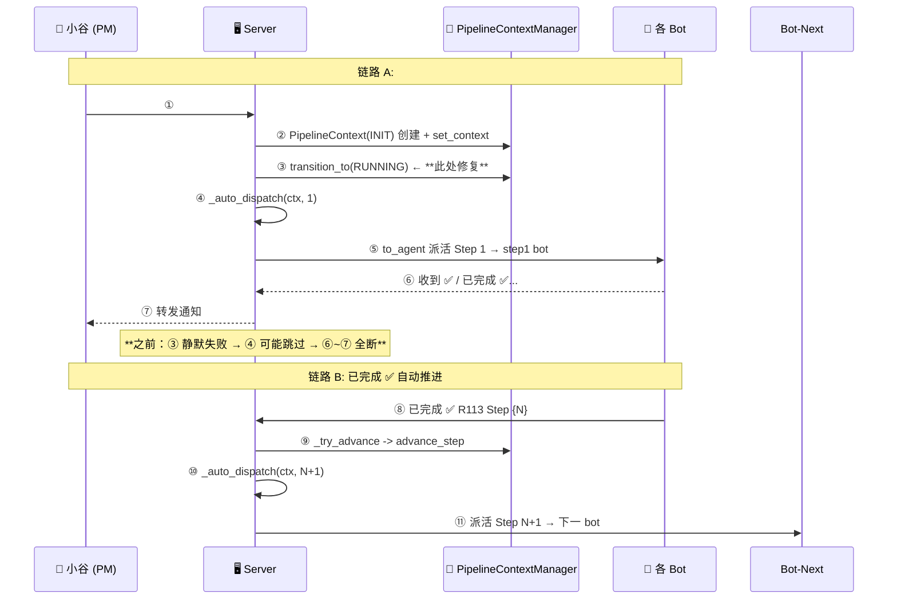

# R113 产品需求 — 管线自动派活修复轮 🔧

> **状态：** 📝 初稿待审核
> **前置条件：** R112 已闭环（pipeline_contexts.json 已清空）
> **改动范围：** `pipeline_context.py` + `main.py` — 仅 2 文件，~10 行改动
> **一句话概括：** 修复管线状态机转换链路 + 数据序列化脆弱性，使 `##start` 能真正自动派活 Step 1，`已完成 ✅` 能自动推进后续 Step

---

## 1. 问题背景

### 1.1 现状

R112 上线后 `##start##R{N}` 创建管线的自动派活链路 **静默断裂**，导致管线卡在 INIT 状态，后续所有自动流转静默失效。R112 实际靠人工 `_inbox:server` to_agent 手工派活完成，自动派活从未验证通过。

**技术债务全景：**

| # | 问题 | 发现方式 | 影响 |
|:-:|:-----|:---------|:-----|
| 1 | 🔴 `##start` 创建管线时 `INIT → RUNNING` 状态转换非法 | 源码审计 | 管线永远卡 INIT，_auto_dispatch/advance_step 全部失效 |
| 2 | 🔴 `PipelineContext.from_dict()` 仍有 5 处硬索引字段 `d["key"]` 无后备值 | 源码审计 | JSON 有缺失字段时 `KeyError` 穿透导致启动崩溃 |
| 3 | 🟡 `_load()` 异常类型不完整，KeyError/ValueError 露网 | 源码审计 | 启动时只 catch `OSError/JSONDecodeError`，其他异常冒泡 |
| 4 | 🟡 `_auto_dispatch()` 查找 step 用 `s.get("name")` 而非 StepInfo 标准字段 | 源码审计 | 后续代码调整后可能静默断流 |

### 1.2 目标

修复上述 4 个问题，使以下两条链路在 `AUTO_DISPATCH_ENABLED=True` 环境下能完整跑通：

**链路 A：`##start` 自动创建 + 派活 Step 1**
```text
##start##R{N}##key=val
  → PipelineContext(INIT) 创建
  → transition_to(RUNNING)  ✅ 成功
  → _auto_dispatch(ctx, 1)  ✅ 向 Step 1 bot 发派活消息
```

**链路 B：`已完成 ✅ R{N} Step {N}` 自动推进 + 派活下一步**
```text
bot 回复 "已完成 ✅ R{N} Step {N}"
  → _try_advance_pipeline()
  → mgr.advance_step()       ✅ step+1
  → _auto_dispatch(ctx, N+1) ✅ 向下一 Bot 发派活消息
```

### 1.3 通信流程



---

## 2. Bug 详情与修复方向

### 2.1 🔴 Bug 1：`INIT → RUNNING` 状态转换非法

**位置：** `server/ws_server/pipeline_context.py` 第 64-72 行

```python
_VALID_TRANSITIONS: dict[PipelineStatus, set[PipelineStatus]] = {
    PipelineStatus.INIT: {PipelineStatus.PLANNING, PipelineStatus.CANCELLED},
    #                          ^^^^^^^^^^^^^^^^
    #                          RUNNING 不在 INIT 的合法目标中！
    ...
}
```

**触发点：** `server/ws_server/main.py` 第 2954 行

```python
# main.py: 2954
await mgr.transition_to(round_name, PipelineStatus.RUNNING)
# transition_to 内部第 355-360 行：
#     if not _is_valid_transition(ctx.status, new_status):
#         logger.warning(...)   # 只打一行 warning
#         return False          # 静默失败！
```

**根因分析：** `##start` 在 `_handle_hash_start()` 创建 PipelineContext 时设为 `INIT`（第 2942 行），然后直接调用 `transition_to(RUNNING)`（第 2954 行）。但 `_VALID_TRANSITIONS` 状态矩阵认为从 `INIT` 只能转 `PLANNING` 或 `CANCELLED`，`RUNNING` 不在合法目标中。`transition_to` 静默返回 `False`，管线状态**永远卡在 INIT**。

**级联影响：**
| 环节 | 代码路径 | 受阻原因 |
|:-----|:---------|:---------|
| `_auto_dispatch` | main.py:2468-2541 | 可以运行（不检查status），但 agent_id/模板可能不完整 |
| `advance_step` | pipeline_context.py:370 | 依赖 `transition_to` 推进状态机，state 卡死 |
| `_try_advance_pipeline` | main.py:2381-2429 | 收到 bot 完成消息后推进失败 |
| `##status` 显示 | main.py:2972 | 显示 INIT 而非 RUNNING，误导 |

**修复方案（2 选 1）：**

| 方案 | 改动 | 风险 |
|:----|:-----|:-----|
| **A ✅ 推荐** | `_VALID_TRANSITIONS[INIT]` 增加 `RUNNING` | 1 行，低风险 |
| B | 在 `##start` 中先 `transition_to(PLANNING)` 再 `transition_to(RUNNING)` | 2 行，需确认过渡状态必要性 |

**具体代码变更（方案 A）：**

```python
# pipeline_context.py:66 修改前
PipelineStatus.INIT: {PipelineStatus.PLANNING, PipelineStatus.CANCELLED},
# 修改后
PipelineStatus.INIT: {PipelineStatus.PLANNING, PipelineStatus.RUNNING, PipelineStatus.CANCELLED},
```

---

### 2.2 🔴 Bug 2：`from_dict` 仍有 5 处硬索引字段

**位置：** `server/ws_server/pipeline_context.py` 第 222-229 行

**现状（R112 只 hotfix 了 `workspace_id`）：**

```python
# 第 223-229 行 — 仍有 5 个直接索引 d["key"]
return cls(
    round_name=d["round_name"],           # ← KeyError 风险
    task_kind=PipelineTaskKind(d["task_kind"]),  # ← KeyError + ValueError
    workspace_dir=Path(d["workspace_dir"]),      # ← KeyError
    task_dir=Path(d["task_dir"]),                # ← KeyError
    workspace_id=d.get("workspace_id", ""),     # ← ✅ 已修复
    pm_inbox_id=d.get("pm_inbox_id", ""),       # ← ✅ 已修复
    status=PipelineStatus(d["status"]),          # ← KeyError + ValueError
    ...
)
```

**影响：** 当 `pipeline_contexts.json` 因任何原因（旧版本自动保存、手动编辑、server crash 导致不完整写入）缺少上述字段时，`from_dict` 直接抛 `KeyError`，没有任何 `.get()` 后备。

**修复方案：**

| 字段 | 当前 | 改为 | 后备值 |
|:-----|:-----|:-----|:-------|
| `d["round_name"]` | 直接索引 | `d.get("round_name", "")` | `""` |
| `d["task_kind"]` | 直接索引 | `d.get("task_kind", "dev")` | `"dev"` |
| `d["workspace_dir"]` | 直接索引 | `d.get("workspace_dir", "")` | `""` |
| `d["task_dir"]` | 直接索引 | `d.get("task_dir", "")` | `""` |
| `d["status"]` | 直接索引 | `d.get("status", "init")` | `"init"` |

> **注意：** `PipelineTaskKind(d["task_kind"])` 改为 `PipelineTaskKind(d.get("task_kind", "dev"))` 后仍可能 `ValueError` 如果值为非法字符串。可以加 try/except 降级到默认值。

---

### 2.3 🟡 Bug 3：`_load()` 异常类型不完整

**位置：** `server/ws_server/pipeline_context.py` 第 769-784 行

```python
def _load(self) -> None:
    path = self._data_dir / _PERSISTENT_FILE
    if not path.exists():
        return
    try:
        data = json.loads(path.read_text(encoding="utf-8"))
        for round_name, d in data.items():
            self._contexts[round_name] = PipelineContext.from_dict(d)  # ← 可能抛 KeyError/ValueError
    except (OSError, json.JSONDecodeError) as e:
        #     ^^^^^^^^^^^^^^^^^^^^^^^^^^^^^^^^
        #     只 catch 了这 2 种异常！KeyError/ValueError冒泡！
        logger.warning("PipelineContext load failed: %s", e)
```

**影响：** Bug 2 的 `KeyError`/`ValueError` 从 `from_dict` 抛出后不被 catch，直接穿透到 `PipelineContextManager.__init__()`（第 270 行），导致整个 manager 初始化失败 → 随后的 `_ensure_pipeline_manager()` 也挂 → 服务启动异常。

**修复方案：**

```python
# 在 except 行增加 KeyError, ValueError
except (OSError, json.JSONDecodeError, KeyError, ValueError) as e:
    logger.warning("PipelineContext load failed: %s", e)
```

或更宽泛：

```python
except Exception as e:
    logger.warning("PipelineContext load failed: %s", e)
```

---

### 2.4 🟡 Bug 4：`_auto_dispatch` 搜索 step 用 `"name"` 字段不一致

**位置：** `server/ws_server/main.py` 第 2498-2499 行

```python
next_step_info = next(
    (s for s in ctx.steps if s.get("name") == next_step_key), None,
    #                          ^^^^^^^^^^
    #                          用 "name" 字段搜索
)
```

**问题：** `StepInfo` dataclass（`pipeline_context.py` 第 28 行）的 step 标识字段叫 `step_key`，不是 `name`。虽然 `##start` 和 `from_work_plan` 创建 steps 时两个字段都填了（`"name": sk` + `"step_key": sk`），但后续如果有人修改创建代码只填 `step_key` 而忘了改这里的查询，自动派活立即静默断流。

**当前兼容性分析：**
| 创建路径 | 是否设置 `"name"` | 是否设置 `"step_key"` | 当前能否搜到 |
|:---------|:-----------------:|:---------------------:|:------------:|
| `##start` (main.py:2909-2919) | ✅ | ✅ | ✅ |
| `from_work_plan` (pipeline_context.py:532-542) | ✅ | ✅ | ✅ |
| 旧 JSON 反序列化 | ⚠️ 取决于旧数据 | ⚠️ 取决于旧数据 | ⚠️ 不确定 |

**修复方案：** 统一使用 `step_key` 查询：

```python
# 修改前
s.get("name")
# 修改后
s.get("step_key") or s.get("name")  # 优先 step_key，回退到 name 保持兼容
```

---

## 3. 改动清单

| 文件 | 改动 | 行数 |
|:-----|:-----|:----:|
| `server/ws_server/pipeline_context.py` | Bug 1: `_VALID_TRANSITIONS[INIT]` 加 `RUNNING` | +1 行 |
| `server/ws_server/pipeline_context.py` | Bug 2: `from_dict` 5 处硬索引改 `.get()` | 5 行 |
| `server/ws_server/pipeline_context.py` | Bug 3: `_load()` 增加 KeyError/ValueError catch | +1 行 |
| `server/ws_server/main.py` | Bug 4: `_auto_dispatch` step 搜索优先 `step_key` | +1 行 |

**总计：2 文件，~8 行改动。**

### 零改动文件

| 文件 | 原因 |
|:-----|:------|
| `handler.py` | 不涉及 `!` 命令 |
| `commands/pipeline.py` | 管线命令体系不动 |
| `config.py` | 无需新增配置项 |
| `templates.py` / `viewer.py` | 纯后端修复，无 Web 端改动 |
| `Dockerfile` | 无新增依赖 |
| `auto_router.py` | 修复仅在状态机层，AutoRouter 不受影响 |

---

## 4. 验收标准

### 4.1 单元测试验证（代码改动后通过）

| # | 验收项 | 方法 |
|:-:|:-------|:------|
| 1 | `_VALID_TRANSITIONS[INIT]` 包含 `RUNNING` | 读改后代码确认 |
| 2 | `from_dict` 5 个硬索引字段全改为 `.get()` | grep 确认无残留 `d["round_name"|"task_kind"|"workspace_dir"|"task_dir"|"status"]` |
| 3 | `_load()` except 包含 `KeyError, ValueError` | 读代码确认 |
| 4 | `_auto_dispatch` step 搜索优先 `step_key` 回退 `name` | 读代码确认 |

### 4.2 生产环境全链路验证

| # | 验收项 | 步骤 | 预期结果 |
|:-:|:-------|:-----|:---------|
| 5 | `##start##R113` 创建管线 + 自动派活 Step 1 | 用小谷发 `##start##R113##requirements_url=...` | 收到回复「✅ R113 管线已启动，Step 1 已派活」，且 Step 1 bot 实际收到派活消息 |
| 6 | Step 1 完成后自动推进 Step 2 | Step 1 bot 回复 `已完成 ✅ R113 Step 1` | `##status##R113` 显示 current_step=2，Step 2 bot 收到派活 |
| 7 | Step 2→6 全链路自动流转 | 各 bot 依次回复完成 | 全 6 步自动完成，最终状态 `COMPLETED` |
| 8 | 测试完毕后 `##stop##R113` | 发 `##stop##R113` | 管线状态变为 CANCELLED |
| 9 | server 重启后 `_load()` 不抛异常 | 检查启动日志 | 无 KeyError/ValueError 相关 WARNING/ERROR |

> **⚠️ 注意：** 验收项 5-7 依赖 `AUTO_DISPATCH_ENABLED=True` 配置。如果生产环境已设为 False，验收时需临时开启。

---

## 5. 开发步骤

### Step 1 — PM 审核（本文档）

> 产出：`docs/R113/R113-product-requirements.md`
> 状态：⏳ 待审核

项目负责人审核通过后进入 Step 2。

### Step 2 — 技术方案 🏗️ 架构师（小开）

由于改动极小（2 文件 ~8 行），技术方案可直接在需求文档基础上确认修复方案，无需另起长篇技术文档。

| # | 确认项 | 说明 |
|:-:|:-------|:------|
| 1 | 状态转换方案选 A 还是 B | A: INIT 加 RUNNING，B: 两步过渡 |
| 2 | `from_dict` 后备值是否合理 | 后备值列表见 §2.2 |
| 3 | `_load()` catch Exception 还是精确 | 精确（+KeyError/ValueError）vs 宽泛（Exception） |
| 4 | `_auto_dispatch` step 搜索兼容方案 | 优先 step_key，回退 name |

### Step 3 — 方向审查 🧐 PM（小谷）

确认方案可行后转开发。

### Step 4 — 编码 💻 开发工程师（爱泰）

改动清单见 §3。**核心要求：改完后用 `python -c "import py_compile; py_compile.compile(...)"` 验证语法。**

### Step 5 — 代码审查 🔍 审查工程师（小周）

**审查清单：**

| # | 审查项 | 严重度 |
|:-:|:-------|:------:|
| 1 | `_VALID_TRANSITIONS` 改动是否破坏其他状态转换路径 | 🔴 P0 |
| 2 | `from_dict` 后备值选择是否合理（不掩盖真正的问题） | 🔴 P0 |
| 3 | `_load()` catch 类型是否覆盖了所有可预见的 from_dict 异常 | 🟡 P2 |
| 4 | `_auto_dispatch` step 搜索改动是否向后兼容 | 🟡 P2 |
| 5 | 4 个 Bug 是否都已修复，无遗漏 | 🔴 P0 |

### Step 6 — Dev 测试 🦐 测试工程师（泰虾）

执行验收项 1-4（单元验证）和 5-7（全链路验证）。**第 5 项 `##start##R113` 必须在生产环境实测通过才能标记完成。**

### Step 7 — 上线验证 🦸 项目管理（小爱）

| # | 验证项 | 方法 |
|:-:|:-------|:-----|
| 1 | `##start##R113` 创建管线 + 自动派活 Step 1 | 用小谷发命令，观察 bot 是否收到 |
| 2 | 全 6 步自动流转 | 各独立 bot 完成，观察自动派发 |
| 3 | `##stop##R113` 停止 | 停止后状态确认 |

### Step 8 — 合并 main + 部署 🦸 项目管理（小爱）

1. 审查 + 测试通过 → 合并 dev → main
2. 重建 Docker 镜像 `ws-bridge:r113`
3. 重启生产容器
4. 健康检查通过 ✅

### Step 9 — 关闭工作室 🦸 项目管理（小爱）

全员 ACK → 归档轮次文档 → 各成员切回大厅待命。

---

## 6. 注意事项

1. **改动极小但影响面大** — 状态转换矩阵是整个管线自动化的根基，改前必须确认无残留非法路径
2. **验证必须在生产环境** — 本地测试和本地 `AUTO_DISPATCH_ENABLED` 不等于生产环境，验收项 5-7 必须在生产容器中实测
3. **AUTO_DISPATCH_ENABLED 在生产环境的当前值** — 需排查生产环境该配置是否被显式设为 False（若为 False 则需临时开启才能验收）
4. **PipelineContext 旧数据已清空** — R112 闭环时 `pipeline_contexts.json` 已清空为 `{}`，`_load()` 不会有旧数据兼容问题，Bug 2 修复后仍要保留 `.get()` 后备以防未来数据异常

---

## 7. 变更记录

| 版本 | 日期 | 变更 |
|:----:|:----:|:------|
| v1.0 | 2026-07-14 | 初稿 — R113 自动派活修复轮 🔧 |
