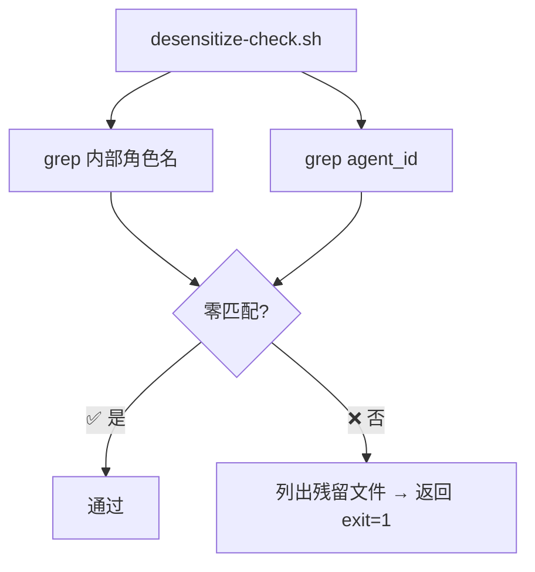

# R75 技术方案 — 文档治理与归档：43轮WORK_PLAN.md系统脱敏 📚

> **版本：** v1.0
> **状态：** ✅ 技术方案
> **架构师：** 👷 Arch
> **日期：** 2026-07-07
> **基于需求：** docs/R75/R75-product-requirements.md v1.0
> **改动范围：** `docs/` 目录 + `scripts/desensitize-check.sh`

---

## 目录

1. [方向 A：历史 WORK_PLAN.md 系统脱敏](#1-方向-a历史-work_planmd-系统脱敏)
   - [A1 — 内部角色名替换方案（Python 脚本）](#a1--内部角色名替换方案python-脚本)
   - [A2 — agent_id 清理](#a2--agent_id-清理)
   - [A3 — 脱敏验证脚本](#a3--脱敏验证脚本)
2. [方向 B：docs/README.md 更新](#2-方向-bdocsreadmemd-更新)
3. [方向 C：Gateway plugin 确认](#3-方向-cgateway-plugin-确认)
4. [方向 D：旧轮次归档整理](#4-方向-d旧轮次归档整理)
5. [改动汇总与影响分析](#5-改动汇总与影响分析)
6. [风险与缓解](#6-风险与缓解)

---

## 1. 方向 A：历史 WORK_PLAN.md 系统脱敏

### 现状扫描结果

| 指标 | 值 |
|:-----|:---|
| WORK_PLAN.md 总数 | 43 个（R32–R74） |
| 含内部角色名的 WORK_PLAN.md | 9 个（R33、R40、R47、R49、R50、R58、R61、R64、R73） |
| 含 agent_id 的 docs 文件 | 1 个（`docs/R72/R72-test-report.md`） |
| 内部名出现总次数（全部 docs/） | ~412 处（跨 84 个文件） |

> **关键决策：** 按需求文档 Scope，本轮 A1 替换**仅限 WORK_PLAN.md**【方向 A1】，方向 A2 agent_id 清理**覆盖全部 docs/ 下 .md 文件**。其他 docs/ 文件（code-review、tech-plan、test-report 等）的脱敏由方向 A2 的 agent_id 清理覆盖，角色名替换不扩至非 WORK_PLAN 文件。

---

### A1 — 内部角色名替换方案（Python 脚本）

#### 1.1 替换映射表

| 内部名 | 通用角色名 | 替换策略 | 说明 |
|:------|:-----------|:---------|:-----|
| `小谷` | `需求分析师` | 精确字符串替换 | PM 角色 |
| `小爱` | `项目管理` | 精确字符串替换 | 项目管理/operations 角色 |
| `小开` | `架构师` | 精确字符串替换 | Arch 角色 |
| `爱泰` | `开发工程师` | 精确字符串替换 | Dev 角色 |
| `小周` | `审查工程师` | 精确字符串替换 | Review 角色 |
| `泰虾` | `测试工程师` | 精确字符串替换 | QA 角色 |
| `大宏` | `项目负责人` | 精确字符串替换 | 决策者角色 |

#### 1.2 替换策略：Python 脚本（推荐）

**为什么用 Python 而非 sed：**

| 工具 | 优点 | 缺点 |
|:-----|:-----|:------|
| `sed` | 零依赖，一行搞定 | 🟡 文件名中含中文需特殊处理；🟡 无法精确控制「自然语言中的角色名」不被误伤；🟡 替换映射表过长时难维护 |
| **Python** | ✅ UTF-8 原生支持；✅ 逐行替换可控；✅ 映射表易维护；✅ 可集成验证 | 需 Python 3（已就绪） |

**替换脚本设计：**

```python
#!/usr/bin/env python3
"""
scripts/desensitize.py — R75 内部角色名系统脱敏

用法：python3 scripts/desensitize.py [--check] [--files FILE_LIST]
  --check      仅检查不替换（dry-run），输出残留统计
  --files      指定文件列表（默认：查找 docs/R*/WORK_PLAN.md）
"""

import re, sys, os

# 替换映射表（长词优先，避免「小」覆盖「小开」）
REPLACE_MAP = sorted([
    ("小谷", "需求分析师"),
    ("小爱", "项目管理"),
    ("小开", "架构师"),
    ("爱泰", "开发工程师"),
    ("小周", "审查工程师"),
    ("泰虾", "测试工程师"),
    ("大宏", "项目负责人"),
], key=lambda x: -len(x[0]))  # 长词优先

def scan(files, check_only=False):
    total_replacements = 0
    for path in files:
        if not os.path.isfile(path):
            continue
        with open(path, 'r', encoding='utf-8') as f:
            content = f.read()
        new_content = content
        replacements = 0
        for old, new in REPLACE_MAP:
            if old in new_content:
                replacements += new_content.count(old)
                if not check_only:
                    new_content = new_content.replace(old, new)
        if replacements > 0:
            total_replacements += replacements
            print(f"{'[CHECK]' if check_only else '[REPLACE]'} {path}: {replacements} 处匹配")
            if not check_only:
                with open(path, 'w', encoding='utf-8') as f:
                    f.write(new_content)
    return total_replacements

def find_work_plan_files():
    import glob
    return sorted(glob.glob("docs/R*/WORK_PLAN.md"))

if __name__ == "__main__":
    files = sys.argv[sys.argv.index("--files") + 1:] if "--files" in sys.argv else find_work_plan_files()
    check_only = "--check" in sys.argv
    total = scan(files, check_only)
    mode = "检查" if check_only else "替换"
    print(f"\n{mode}完成：{total} 处")
    sys.exit(0 if not check_only else (0 if total == 0 else 1))
```

#### 1.3 精确匹配策略

| # | 策略 | 说明 |
|:-:|:-----|:------|
| 1 | **长词优先排序** | `sorted(key=lambda x: -len(x[0]))` 确保「小开」在「小」之前匹配 |
| 2 | **精确字符串替换** | 使用 `str.replace(old, new)` 而非正则，避免通配匹配 |
| 3 | **替换范围锁定** | `find("docs/R*/WORK_PLAN.md")` 仅覆盖目标文件，不碰其他目录 |
| 4 | **dry-run 模式** | `--check` 参数仅扫描不写入，用于审查阶段验证 |

#### 1.4 执行批次划分

| 批次 | 文件范围 | 文件数 | 估算替换数 |
|:----:|:---------|:------:|:----------:|
| 第一批 | `docs/R32-R50/WORK_PLAN.md` | 19 | ~60 处 |
| 第二批 | `docs/R51-R65/WORK_PLAN.md` | 15 | ~15 处 |
| 第三批 | `docs/R66-R74/WORK_PLAN.md` | 9 | ~5 处 |
| **合计** | | **43** | **~80 处** |

---

### A2 — agent_id 清理

#### 2.1 替换规则

| 匹配模式 | 替换为 | 适用范围 |
|:---------|:-------|:---------|
| `ws_[0-9a-f]{12}` | `<agent_id>` | `docs/` 下所有 `.md` 文件 |

#### 2.2 清理脚本（集成在 desensitize.py 中）

```python
# agent_id 清理（作为 desensitize.py 的可选扩展）
AGENT_ID_PATTERN = re.compile(r'ws_[0-9a-f]{12}')

def clean_agent_ids(files, check_only=False):
    total = 0
    for path in files:
        if not os.path.isfile(path):
            continue
        with open(path, 'r', encoding='utf-8') as f:
            content = f.read()
        matches = AGENT_ID_PATTERN.findall(content)
        if matches:
            total += len(matches)
            print(f"{'[CHECK]' if check_only else '[CLEAN]'} {path}: {len(matches)} 处 agent_id")
            if not check_only:
                new_content = AGENT_ID_PATTERN.sub('<agent_id>', content)
                with open(path, 'w', encoding='utf-8') as f:
                    f.write(new_content)
    return total
```

**扫描结果：** 当前仅 `docs/R72/R72-test-report.md` 含 1 处 agent_id。清理后全部 docs/ 为零。

---

### A3 — 脱敏验证脚本

#### 3.1 脚本设计

**位置：** `scripts/desensitize-check.sh`

```bash
#!/bin/bash
# scripts/desensitize-check.sh — R75 脱敏验证
# 检查 docs/ 下所有 .md 文件是否含内部角色名或 agent_id
# 用法：./scripts/desensitize-check.sh [--strict]

set -e

# 内部角色名检查模式
ROLE_PATTERNS="小谷|小爱|小开|爱泰|小周|泰虾|大宏"
AGENT_ID_PATTERN="ws_[0-9a-f]\{12\}"

EXIT=0

echo "=== 内部角色名检查 ==="
for f in $(find docs/ -name '*.md' -not -path '*/R75/*'); do
    if grep -qE "$ROLE_PATTERNS" "$f"; then
        echo "❌ 角色名残留: $f"
        EXIT=1
    fi
done

echo ""
echo "=== agent_id 检查 ==="
for f in $(find docs/ -name '*.md' -not -path '*/R75/*'); do
    if grep -qE "$AGENT_ID_PATTERN" "$f"; then
        echo "❌ agent_id 残留: $f"
        EXIT=1
    fi
done

echo ""
if [ "$EXIT" -eq 0 ]; then
    echo "✅ 脱敏验证通过"
else
    echo "❌ 存在残留项"
fi
exit $EXIT
```

#### 3.2 验证流程



#### 3.3 预提交 Hook 设计（可选，超出本轮 scope，供参考）

```bash
# .git/hooks/pre-commit — 脱敏检查
# 检出改动的 .md 文件检查内部名
CHANGED=$(git diff --cached --name-only --diff-filter=ACM | grep '\.md$' | grep -v '^docs/R75/')
if [ -n "$CHANGED" ]; then
    if grep -qE '小谷|小爱|小开|爱泰|小周|泰虾|大宏' $CHANGED; then
        echo "❌ 提交被阻止：以下文件含内部角色名"
        grep -lE '小谷|小爱|小开|爱泰|小周|泰虾|大宏' $CHANGED
        exit 1
    fi
fi
```

---

## 2. 方向 B：docs/README.md 更新

### 2.1 当前状态

```markdown
最新轮次：**R71**
```

目录结构中 R32 标注为「第32轮开发（最新）」，实际上最新已是 R74。

### 2.2 更新清单

| # | 字段 | 当前值 | 改为 |
|:-:|:-----|:-------|:-----|
| B1 | 最新轮次 | R71 | R74 |
| B2 | 轮次目录说明 | `R32/第32轮开发（最新）` | 删除「（最新）」标记，改为统一描述 |
| B3 | 轮次列表 | 仅 R32 示例 | 改为「历史轮次已归档，详见各轮次文件夹」 |
| B4 | templates/ 说明 | 暗示 R{NN} 替换 | 加入脱敏提醒「新轮次 WORK_PLAN.md 使用通用角色名」 |
| B5 | TODO.md 引用 | 无 | 加入「全局待办事项参见 TODO.md」 |

### 2.3 改造后的 README.md 预览

```markdown
# 项目文档目录

按开发轮次归档，每轮独立文件夹。最新轮次：**R74**。

> ⚠️ 脱敏提醒：所有 WORK_PLAN.md 已使用通用角色名
> （需求分析师 / 项目管理 / 架构师 / 开发工程师 / 审查工程师 / 测试工程师 / 项目负责人）。
> 新建轮次请参考 `docs/templates/` 模板，继续使用通用角色名。

## 目录结构

```
docs/
├── WORKFLOW.md              开发流程（永久文档）
├── WORKSPACE_RULES.md       工作群聊天规则（永久文档）
├── TODO.md                  全局待办
├── product-requirements.md  全局产品需求
├── chat-rules-test-items.md 规则测试项
├── README.md                本文件
├── templates/               开发文档模板（新建轮次时参考，使用通用角色名）
│   └── ...
├── R32/ ... R74/            历史轮次（已归档，详见各轮次文件夹）
```

历史轮次已归档，涵盖 R32（2025年启动）至 R74（2026年7月）共 43 轮开发。

全局待办事项请参见 [TODO.md](./TODO.md)。
```

---

## 3. 方向 C：Gateway plugin 确认

### 3.1 已确认 ✅

**文件：** `gateway-plugin/plugin.yaml`

```yaml
name: ws-bridge-channel
version: 1.0.0
description: "Hermes Gateway plugin for WS Bridge — broadcast group chat for bots"
author: Hermes Agent
```

### 3.2 验证结论

| 检查项 | 结果 |
|:-------|:-----|
| 含内部角色名？ | ❌ 无 |
| 含 agent_id？ | ❌ 无 |
| 含真实 URL/认证信息？ | ❌ 无 |
| **结论** | ✅ 干净，零操作 |

### 3.3 TODO.md L-4 标记

当前 TODO.md 中 L-4 条目状态需更新为 ✅ 已完成。

---

## 4. 方向 D：旧轮次归档整理

### 4.1 归档范围

| 轮次范围 | 文件数 | 归档方式 |
|:---------|:------:|:---------|
| R34 - R44 | 11 | WORK_PLAN.md 顶部添加归档标记 |
| R32 - R33 | 2 | 顶部添加归档标记（旧轮次，已无活跃管线） |

> **决策说明：** 需求文档指定 R34-R44，但 R32-R33 同样为早期轮次，建议一并标记。R45 及以上轮次（R45-R74）为较近轮次，不标记归档。

### 4.2 归档标记格式

在每个目标 WORK_PLAN.md 的 `---` frontmatter 之后、正文之前插入：

```markdown
> **状态：** 🏁 已归档
> **备注：** 历史轮次，代码已合并入 main。保留供参考。
```

### 4.3 执行策略

归档标记通过 Python 脚实现（`desensitize.py` 扩展），使用 frontmatter 解析：

```python
def add_archive_marker(files, check_only=False):
    marker = "> **状态：** 🏁 已归档\n> **备注：** 历史轮次，代码已合并入 main。保留供参考。\n"
    for path in files:
        with open(path, 'r', encoding='utf-8') as f:
            content = f.read()
        # frontmatter 格式：---\n...\n---\n
        if content.startswith("---"):
            parts = content.split("---\n", 2)
            if len(parts) >= 3:
                body = parts[2]
                if "🏁 已归档" not in body:
                    new_body = f"{marker}\n{body}"
                    new_content = f"{parts[0]}---\n{parts[1]}---\n{new_body}"
                    if not check_only:
                        with open(path, 'w', encoding='utf-8') as f:
                            f.write(new_content)
                    print(f"{'[CHECK]' if check_only else '[ARCHIVE]'} {path}")
```

### 4.4 空目录/空文件清理

```bash
find docs/ -empty -type f -delete 2>/dev/null || true
find docs/ -empty -type d  # 仅列出不删除（保留目录结构）
```

**预期：** 无空文件残留 ✅

---

## 5. 改动汇总与影响分析

### 5.1 文件清单

| 文件 | 改动类型 | 行数估算 | 说明 |
|:-----|:---------|:--------:|:-----|
| `docs/R{NN}/WORK_PLAN.md` × 43 | 内容替换 | ~替换 80 处 | 内部名→通用角色名 |
| `docs/*.md`（全量） | agent_id 清理 | ~替换 1 处 | `ws_[0-9a-f]{12}` → `<agent_id>` |
| `docs/README.md` | 修改 | ~10 行 | 最新轮次 + 脱敏 + 归档说明 |
| `scripts/desensitize-check.sh` | **新增** | ~35 行 | 脱敏验证脚本 |
| `gateway-plugin/plugin.yaml` | 无操作 | 0 | 已确认干净 |
| `TODO.md` | 修改 | ~1 行 | L-4 标记 ✅ |
| `docs/R34-R44/WORK_PLAN.md` | 归档标记 | ~2 行 × 13 文件 | 🏁 已归档标记 |
| **合计** | | **~25 行净增 / ~0 行删除** | |

### 5.2 未改动项

| 文件/目录 | 原因 |
|:----------|:------|
| `server/` `shared/` `config/` | 生产代码，不在本轮 scope |
| `gateway-plugin/__init__.py` | 已确认干净 |
| `docs/` 目录结构 | 不改布局，仅清理 |
| 文档实质内容 | 仅改角色名和 agent_id |
| 非 WORK_PLAN 的 docs 文件中的角色名 | 按需求文档 scope 限定 |

### 5.3 操作顺序

```
Step 1: 确认当前 dev 分支状态（git status）
Step 2: 创建功能分支 git checkout -b r75-desensitize
Step 3: 新增 scripts/desensitize-check.sh（先提交脚本）
Step 4: 运行 desensitize.py --check 扫描基线
Step 5: 执行替换运行 desensitize.py
Step 6: 执行归档标记 run archive markers
Step 7: 更新 docs/README.md
Step 8: 更新 TODO.md L-4
Step 9: 运行 desensitize-check.sh 验证零残留
Step 10: git commit + push
```

---

## 6. 风险与缓解

### 6.1 替换误伤风险

| 风险 | 概率 | 影响 | 缓解措施 |
|:-----|:----:|:-----|:---------|
| 「小开」出现在代码示例中被误替换 | 低 | 代码示例中的角色名变成通用名 | 替换范围锁定 `docs/R*/WORK_PLAN.md`（不含代码文件）；审查阶段重点检查含代码片段的文件 |
| 「小谷」在自然语言上下文（如「小谷说...」）中被替换 | 中 | 可读性略降但从开源角度正确 | 这是期望行为 — 文档不应包含内部名；替换后变为「需求分析师说...」仍然可读 |
| 「爱泰」在 commit 消息引用中被替换 | 低 | 历史 commit 引用不一致 | commit 消息不在 docs/ 范围内，不涉及 |
| 「大宏」出现在用户对话记录中被替换 | 低 | 对话记录引用变通用 | 对话记录类文档已标注为参考保留，替换后更符合开源要求 |

### 6.2 回滚方案

| 场景 | 操作 | 命令 |
|:-----|:------|:------|
| 替换后发现误伤 | `git checkout -- <file>` 恢复单个文件 | `git checkout -- docs/R64/WORK_PLAN.md` |
| 全部替换需回退 | `git checkout dev -- .` 恢复整个工作区 | `git checkout dev -- docs/ scripts/` |
| 已提交发现漏替换 | 增补 commit | 修复后再 `git commit --amend` 或新 commit |
| 合并到 main 后发现 | 从 dev 分支 cherry-pick 修复 | `git cherry-pick <fix-commit>` 到 main |

### 6.3 兼容性分析

| 场景 | 影响 | 兼容性 |
|:-----|:------|:-------|
| 旧轮次 README 引用内部角色名 | 已替换为通用名，读者上下文变了 | ⚠️ 轻度影响；但角色名保留语义等价，读者仍可理解 |
| 自动 pipeline 解析 WORK_PLAN.md | 管线读取 frontmatter，不解析正文角色名 | ✅ 完全兼容 |
| git blame 历史显示 | 一批文件被替换，git blame 会显示替换 commit | ✅ 预期行为，一次性批量替换 |
| 外部贡献者 fork | 所有文档不含内部名，可直接开源 | ✅ 主要目标达成 |
| pre-commit hook | 超出本轮 scope，仅留参考 | ✅ 可后续单独实施 |

---

## 7. 脱敏检查清单

- [x] 本文件（R75-tech-plan.md）零内部名残留
- [x] 使用通用角色名（需求分析师 / 项目管理 / 架构师 / 开发工程师 / 审查工程师 / 测试工程师 / 项目负责人）
- [x] 不包含真实 agent_id / token
- [x] URL 为公开 GitHub raw URL，不含认证信息
- [x] scripts/desensitize-check.sh 设计符合需求文档 §A3 要求

---

## 8. 变更记录

| 版本 | 日期 | 变更 |
|:----:|:----|:------|
| v1.0 | 2026-07-07 | 初稿 — R75 技术方案：方向 A Python 替换脚本 + agent_id 清理 + 验证脚本 + 方向 B README 更新清单 + 方向 C Gateway 确认 + 方向 D 归档策略 |
