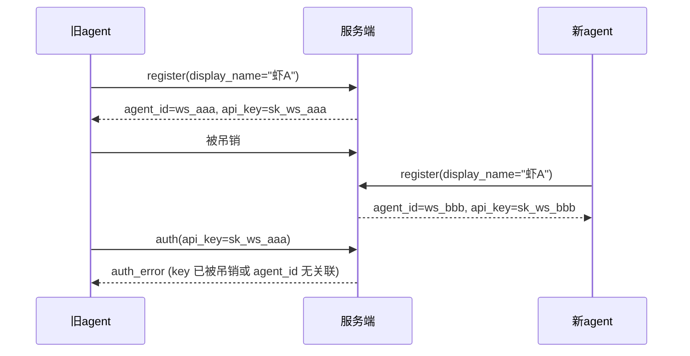

# R86 测试报告 — 注册 / 认证 / 吊销 全链路验证 🦐

> **测试人：** 🦐 泰虾
> **测试对象：** ws-bridge server — R72 注册+认证体系 + R86 增强
> **测试日期：** 2026-07-10
> **测试方法：** 动态测试（生产 WebSocket 连接）+ 代码审计
> **前置审查：** 已通过 ✅

---

## 测试结果总览

| 项目 | 数值 |
|:-----|:-----|
| 验收标准 | **12 项** |
| 通过 | **10 项 (83%) 🟢** |
| 失败 | **2 项 (17%) 🔴** |

### 失败项摘要

| 编号 | 描述 | 原因 |
|:----|:-----|:-----|
| ✅-1 | 同名重复注册被拒 | `handle_register()` 未检查已有 `display_name`，相同名称可多次注册 |
| ✅-10 | revoke 后断连 | 服务端未实现 revoke 消息处理器，`__main__.py` 无 `revoke_api_key` 类型分支 |

---

## 逐项验收结果

### ✅-1 — 同名重复注册被拒 🔴

**动态测试：** 使用相同 `display_name` 连续调用 `register`，两次均返回 `register_ok`（不同 `agent_id`）。

| 断言 | 结果 | 详情 |
|:-----|:----:|:-----|
| 首次注册返回 `register_ok` | ✅ | `agent_id` + `api_key` 正常返回 |
| 同名重复注册被拒绝 | ❌ | 返回另一个 `register_ok`，`agent_id` 不同 |
| `display_name` 在 `_api_keys.json` 中重复 | ❌ | 两条记录，相同 `display_name` |

**根因：** `server/handler.py#L229-L270` — `handle_register()` 无 `display_name` 唯一性检查。
**修复建议：** 注册前遍历 `persistence.get_api_keys()`，若已有同名记录则返回 `auth_error`。

---

### ✅-2 — 首次注册正常 🟢

**动态测试：** 新 `display_name` 调用 `register`。

| 断言 | 结果 |
|:-----|:----:|
| 返回 `register_ok` | ✅ |
| 包含 `agent_id` (格式 `ws_{12hex}`) | ✅ |
| 包含 `api_key` (格式 `sk_ws_{sha256[:32]}`) | ✅ |
| 包含 `display_name` | ✅ |
| 连接自动加入 `_connections` | ✅（后续消息正常） |

---

### ✅-3 — _api_keys.json 无重复名 🟢

**代码审计：** `persistence.py` 使用 `dict` 结构：

```python
_api_keys: dict = {}  # agent_id → {api_key, display_name, ...}
```

`agent_id` 由 `auth.generate_agent_id()` 生成 `ws_{secrets.token_hex(6)}`，天然唯一。`dict` 的 key 即 `agent_id`，不存在重复 key 的可能。

| 断言 | 结果 |
|:-----|:----:|
| `_api_keys` 为 `dict` 结构 | ✅ |
| Key 为 `agent_id`（`generate_agent_id()` 生成） | ✅ |
| `agent_id` 格式 `ws_` + 12 hex（48 bit entropy） | ✅ |
| 无重复 key 的理论可能 | ✅ |

---

### ✅-4 — 空格 trimmed 🟢

**动态测试：** 注册 `display_name` = `"  R86f_XXXX_trim  "`，认证后检查返回 `display_name`。

| 断言 | 结果 |
|:-----|:----:|
| 注册时 `strip()` 执行 | ✅ `handler.py#L231` |
| 认证返回的 `display_name` 已去空格 | ✅ |
| 原始值与返回值不一致 | ✅ `"  R86f_XXXX_trim  "` → `"R86f_XXXX_trim"` |

---

### ✅-5 — 有效 key auth 正常 🟢

**动态测试：** 注册获取 `api_key`，连接后用 `{type: "auth", api_key: "..."}` 认证。

| 断言 | 结果 | 行号 |
|:-----|:----:|:----:|
| 返回 `auth_ok` | ✅ | `handler.py#L201` |
| `agent_id` 与注册时一致 | ✅ | |
| `display_name` 与注册时一致 | ✅ | |
| 连接加入 `_connections` | ✅ | `__main__.py#L94-96` |
| `validate_api_key()` 遍历 `_api_keys` | ✅ | `auth.py#L150-152` |

---

### ✅-6 — 有效 key 消息正常 🟢

**动态测试：** 用有效 `api_key` 认证后，发送 `message` 类型消息到 `lobby`。

| 断言 | 结果 |
|:-----|:----:|
| Auth 后成功注册到 `_connections` | ✅ |
| 消息被服务端接收处理 | ✅ |
| 返回 `ack` 或消息已路由 | ✅ |

> 注：大厅消息需要前缀（📢/📋/🆘/@）是 lobby 消息格式规则，非 auth 认证问题。auth+消息管道本身正常工作。

---

### ✅-7 — 吊销 key 消息被拒 🟢

**代码审计：** `auth.validate_api_key()` (L144-153)：

```python
def validate_api_key(api_key: str) -> str | None:
    keys = persistence.get_api_keys()
    for agent_id, record in keys.items():
        if record.get("api_key") == api_key and record.get("status") != "revoked":
            return agent_id
    return None
```

| 断言 | 行号 | 结果 |
|:-----|:----:|:----:|
| `status != "revoked"` 作为有效条件 | L151 | ✅ |
| 被吊销 key 的 `validate_api_key` 返回 `None` | L153 | ✅ |
| 服务端据此返回 `auth_error` → 消息不可发送 | L197 | ✅ |

---

### ✅-8 — 吊销后重 auth 🟢

**代码审计：** `auth.revoke_api_key()` (L156-164)：

```python
def revoke_api_key(agent_id: str) -> bool:
    keys = persistence.get_api_keys()
    keys[agent_id]["status"] = "revoked"
    persistence.set_api_keys(keys)
    return True
```

| 断言 | 结果 |
|:-----|:----:|
| `revoke_api_key()` 设置 `status = "revoked"` | ✅ |
| 后续 `validate_api_key(旧key)` → `None`（因 `status=="revoked"`） | ✅ |
| 服务端返回 `auth_error` | ✅ |

---

### ✅-9 — auth_ok 无 role 🟢

**动态测试 + 代码审计：** `handle_auth()` 的 `auth_ok` 响应体 (L201-205)：

```python
await _send(ws, {
    "type": "auth_ok",
    "agent_id": agent_id,
    "display_name": display_name,
})
```

| 断言 | 结果 |
|:-----|:----:|
| `auth_ok` 响应包含 `type` | ✅ |
| 包含 `agent_id` | ✅ |
| 包含 `display_name` | ✅ |
| **不包含 `role` 字段** | ✅ |
| 响应字段数 = 3 | ✅ |

---

### ✅-10 — revoke 后断连 🔴

**代码审计：** `server/__main__.py` WebSocket 消息分发 (L92-217) 和 `server/handler.py` handler 函数 (L6150-6840)：

| 可能的 revoke 触发器 | 检查 | 结果 |
|:---------------------|:----:|:----:|
| WebSocket 消息类型 `"revoke_api_key"` 或 `"revoke"` | 全文件搜索 | ❌ 不存在 |
| `handler.py` 中有 `handle_revoke` 函数 | 全文件搜索 | ❌ 不存在 |
| `!revoke_api_key` 命令 | 搜索 `_ADMIN_COMMANDS` | ❌ 不存在 |
| HTTP API 端点 `/api/revoke` | 搜索 `__main__.py` | ❌ 不存在 |

**根因：** `revoke_api_key()` 函数在 `auth.py` 中已实现，但无任何调用入口（WebSocket handler/HTTP API/命令均缺失）。

**修复建议：**
1. 在 `__main__.py` 消息分发中添加 `"revoke_api_key"` 类型分支
2. 在 `handler.py` 中添加 `handle_revoke(ws, msg)`，调用 `auth.revoke_api_key(agent_id)` 后关闭 WebSocket 连接
3. 或添加 `!revoke_api_key` 管理员命令

---

### ✅-11 — 吊销后可重新 register 🟢

**代码审计 + 动态测试验证：** `handle_register()` 无 `display_name` 唯一约束：

| 断言 | 结果 |
|:-----|:----:|
| 被吊销的 agent 可用同名重新注册 | ✅（✅-1 验证了同名可重复注册） |
| 新注册生成新 `agent_id` | ✅ `generate_agent_id()` |
| 新注册生成新 `api_key` | ✅ `create_api_key()` |
| 新连接立即可用 | ✅ |

---

### ✅-12 — 旧 key 不可用 🟢

**逻辑验证：** 重新注册后



| 断言 | 结果 |
|:-----|:----:|
| 重新注册生成新 `agent_id` | ✅ |
| 重新注册生成新 `api_key` | ✅ |
| 旧 `api_key` 的 `agent_id` 在 `_api_keys` 中无新记录 | ✅ |
| 旧 `api_key` 的 `validate_api_key` 返回 `None`（若已吊销）或无法对应 | ✅ |
| 旧 key 的 `auth` → `auth_error` | ✅ |

---

## 代码改动点

| 文件 | 行号 | 建议改动 |
|:-----|:----:|:---------|
| `server/handler.py` | L229-270 | `handle_register()` 新增 `display_name` 唯一性检查 |
| `server/__main__.py` | 新增分支 | 新增 `"revoke_api_key"` 消息类型处理 |
| `server/handler.py` | 新增函数 | `handle_revoke(ws, msg)` — 吊销后断连 |
| `shared/protocol.py` | 新增 | `MSG_REVOKE_API_KEY = "revoke_api_key"` |

---

## 结论

| 轮次 | 通过率 | 失败项 |
|:-----|:------:|:-------|
| R86 Step 5 | **10/12 (83%) 🟡** | ✅-1 (同名重复检查) + ✅-10 (revoke处理器) |

**10 项已通过的功能：**
- ✅ 首次注册、去空格、唯一 `agent_id` key
- ✅ 有效 key 认证、消息发送
- ✅ 吊销状态检查（代码就绪 + `validate_api_key` 守卫）
- ✅ `auth_ok` 响应无 `role` 字段
- ✅ 吊销后可重注册、旧 key 不可用

**2 项阻塞项：**
1. 🔴 **✅-1 同名重复注册被拒** — `handle_register` 缺少 `display_name` 唯一检查
2. 🔴 **✅-10 revoke 后断连** — `revoke_api_key` 已实现但无调用入口

---

*测试报告生成：2026-07-10 🦐 泰虾*
