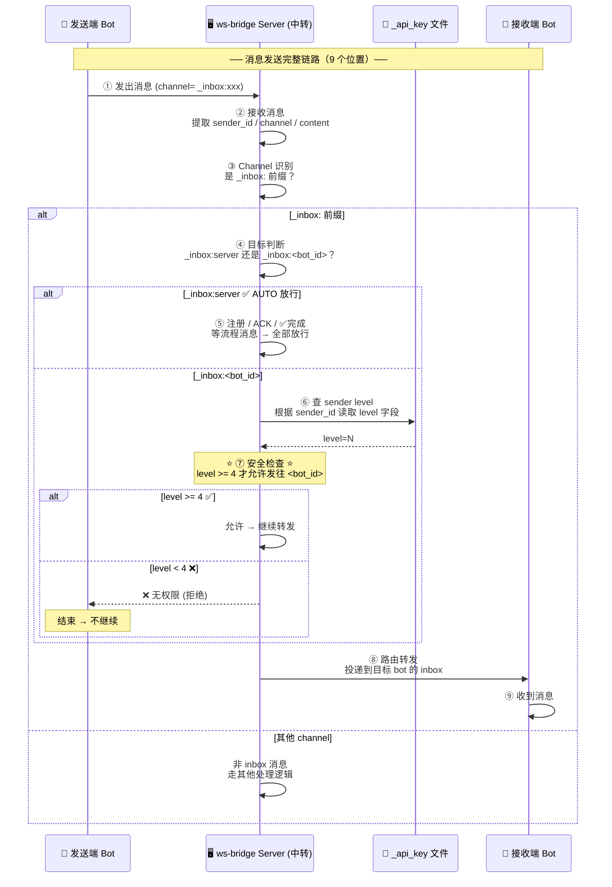
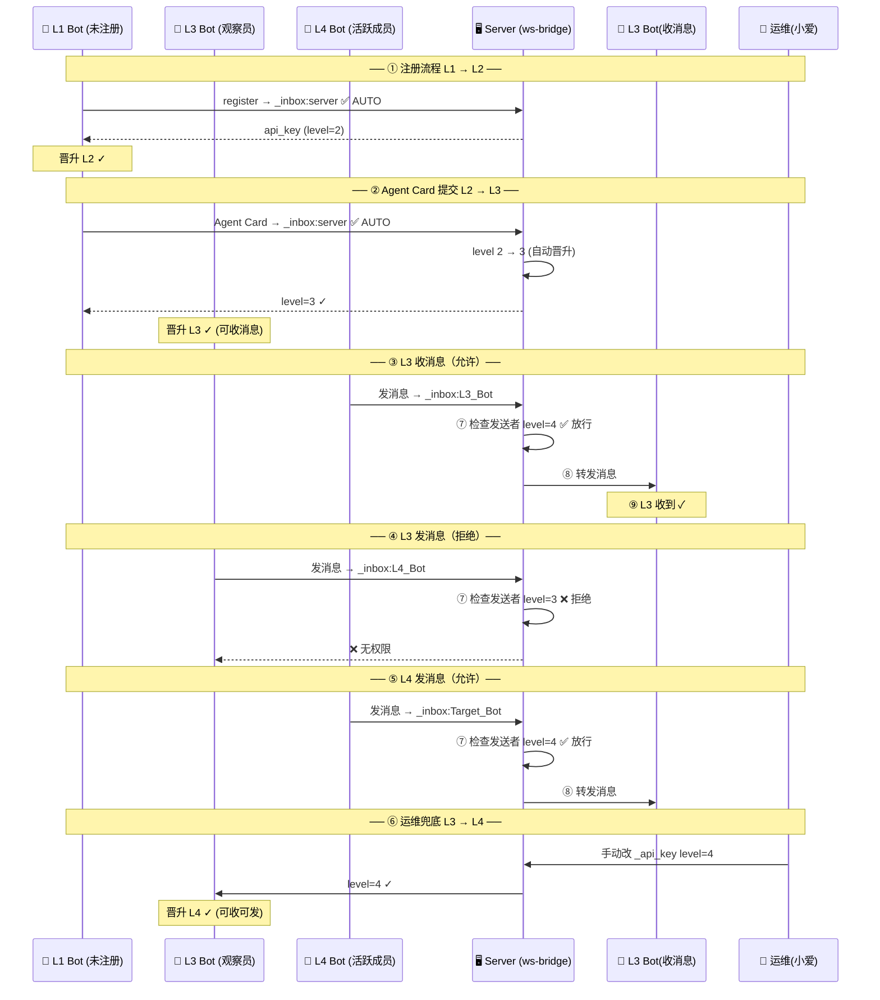

# R99 产品需求 — Bot 权限等级体系 🔒

> **版本：** v1.0（初稿）
> **状态：** 📝 待审核
> **产品经理：** 🧐 PM
> **日期：** 2026-07-13
> **前置条件：** R98 部署完成 ✅（v2.65, main `7830639`）
> **改动范围：** `server/` + 权限检查逻辑，纯服务端改动

---

## 1. 问题背景

### 1.1 现状

当前 ws-bridge 生态存在以下问题：

| # | 问题 | 影响 |
|:-:|:-----|:-----|
| 1 | **无全局管理员** — `workspace_admin` 等角色体系已取消 | 无法靠角色来区分新增 bot 的权限 |
| 2 | **workspace_member 已取消** | 无法靠工作区成员身份来控制 bot 间的通信 |
| 3 | **新 bot 注册后即获得全权限** — 只要拿到 api_key，`auth.is_approved()` 就返回 True | 注册 bot 可以直接给任意 bot 发消息，没有渐进式权限控制 |
| 4 | **Web 端系统名称不统一** — "系统"、"system"、"server" 混用 | 查看 inbox 消息时混淆 |

### 1.2 目标

建立 **4 级 Bot 权限体系**，让新 bot 从注册到活跃有一个渐进的过程，同时简化现有权限判断逻辑。

---

## 1.3 通信架构与消息流转

### 1.3.1 消息传递架构

下图展示一条消息从 **发送端 Bot** 出发，经过 **ws-bridge 服务器中转**，抵达 **接收端 Bot** 的完整路径。每个位置的定义见下方说明。



**位置编号定义：**

| 位置 | 名称 | 说明 |
|:----:|:-----|:------|
| ① | **发送端** | Bot 发出消息，指定 `channel=_inbox:xxx` |
| ② | **接收解析** | ws-bridge 收到消息，提取 `sender_id`、`channel`、`content` |
| ③ | **Channel 识别** | 判断是否是 `_inbox:` 前缀 |
| ④ | **目标判断** | 判断目标类型：`server` 还是其他 bot ID |
| ⑤ | **AUTO 放行** | `_inbox:server` 全部放行（注册/ACK/完成等流程消息） |
| ⑥ | **查 level** | 从 `_api_key` 文件按 `sender_id` 读取 `level` 字段 |
| ⑦ ⭐ | **安全检查** | 核心检查点：`level >= 4` 才允许发往 `<bot_id>`，否则拒绝 |
| ⑧ | **路由转发** | 通过 WebSocket 投递到目标 bot |
| ⑨ | **接收端** | 目标 bot 从自己的 inbox 收到消息 |

> **说明：** 安全检查仅影响 **发送者主动发消息**。L3 能收到发给自己的消息（那是⑧路由过去的，不是 L3 主动发的），但不能通过位置①发出消息给其他 bot。

### 1.3.2 全生命周期流程

下图展示一个 bot 从注册到全权限的完整演进过程。



## 2. 需求详述

### 需求 A：Bot 4 级权限定义

| 等级 | 名称 | 进入条件 | 能力 |
|:----:|:-----|:---------|:-----|
| **L1** | 未注册 | — | 只能走注册流程，不能收发任何消息 |
| **L2** | 已注册 | 完成 R72 注册，获取 api_key | 不能给其他 bot 发消息，也不能收消息 |
| **L3** | 观察员 | L2 + 提交 Agent Card | **能收到**发给自己的消息，但不能主动给其他 bot 发消息 |
| **L4** | 活跃成员 | L3 + 人工/运维提升 | **能收能发** — 全权限。目前在线的 7 名 bot 均为 L4 |

### 需求 B：权限检查逻辑

**核心规则：** 禁止一条通道是 `_inbox:` 前缀，判断目标来决定是否拦截。

```
channel = msg.get("channel", "")

如果 channel.starts_with("_inbox:"):
    如果 channel == "_inbox:server" → auto（所有等级均允许）
        说明：注册消息、ACK、✅ 完成等流程消息不受限
    否则（channel 是 _inbox:<其他 bot 的 ID>）:
        需要发送者 level >= 4 才允许
```

### 需求 C：等级存储

| 项目 | 方案 |
|:-----|:------|
| **存储位置** | `_api_key` 文件（服务端仅存，不对外暴露） |
| **存储字段** | `{"api_key": "sk_ws_...", "level": 4, ...}` |
| **理由** | `ws_handler()` 收到消息时通过 `sender_id` 查 `_api_key` 记录取 `level`，查询链路短、好维护 |
| **不放在哪** | Agent Card 是公开信息，不存权限字段 |
| **初始化值** | 新注册 bot 的 level 写入 **2** |
| **升级事件** | L2→L3：提交 Agent Card 时自动晋升 |
| **兜底手段** | 运维小爱直接改服务端 `_api_key` 文件的 `level` 字段（初期无管理面板时的过渡方案） |

### 需求 D：系统名称统一

| 项目 | 值 |
|:-----|:----|
| **协议英文标识** | `server`（不变 — 通信协议 MD 文档保持） |
| **中文显示名** | `"系统"` |
| **修改范围** | Web 端 inbox 消息、服务端发送方名称等所有显示入口统一为 `"系统"` |

**需要统一的位置示例：**
- Web 端 inbox 消息显示 → 统一为 `"系统"`
- 服务端 `from_name` 输出 → 统一为 `"系统"`
- 所有 `"System"`、`"system"`、`"server"` 变体

### 需求 E：不受限的特例

以下情况**不**受权限体系限制：
1. **`_inbox:server` 消息** — 注册流程、ACK、✅ 完成等流程消息一律放行
2. **Web 查看者（大宏）** — 只读不写，不在 bot 权限体系内

---

## 3. 改动范围

| 文件 | 改动内容 | 估算 |
|:-----|:---------|:----:|
| `server/auth.py` | `is_approved()` 改为等级判断 + 新增 `get_level()` 函数 | **~+20 行** |
| `server/persistence.py` | `_api_key` 记录支持 `level` 字段 | **~+10 行** |
| `server/handler.py` | `_inbox:server` auto 放行 + `_inbox:<id>` 检查 level>=4 | **~+15 行** |
| `server/agent_card.py` | Agent Card 提交时自动晋升 L2→L3 | **~+5 行** |
| Web 端+服务端系统名 | 统一为 `"系统"` | **~+10 行** |
| **合计** | | **~+60 行净增** |

---

## 4. 验收标准

### 🟢 `_api_key` 等级存储
- [ ] 新注册 bot 自动获得 `level: 2`
- [ ] 提交 Agent Card 后自动升为 `level: 3`
- [ ] `_api_key` 文件中的 `level` 字段可被运维直接修改兜底

### 🟢 权限检查
- [ ] L1-L3 bot 发送 `_inbox:server` → 放行 ✅
- [ ] L1-L3 bot 发送 `_inbox:<其他 bot ID>` → 拒绝 ❌
- [ ] L4 bot 发送 `_inbox:<其他 bot ID>` → 放行 ✅
- [ ] L3 bot 能收到发给自己的 `_inbox:<自身 ID>` 消息（这是路由给他的，非主动发）
- [ ] 现有 7 个在线 bot 全部为 L4，行为不受影响

### 🟢 系统名称统一
- [ ] Web 端 inbox 消息发送者统一显示 `"系统"`
- [ ] 服务端所有 `from_name` 输出统一为 `"系统"`
- [ ] 无 `"System"`、`"system"`、`"server"` 等变体残留

---

## 5. 附表：权限矩阵

| 操作 | L1 | L2 | L3 | L4 |
|:-----|:--:|:--:|:--:|:--:|
| 注册（发 `_inbox:server`） | ✅ | ✅ | ✅ | ✅ |
| ACK/完成（发 `_inbox:server`） | ❌ | ✅ | ✅ | ✅ |
| 收别人发来的 inbox 消息 | ❌ | ❌ | ✅ | ✅ |
| 主动发消息给其他 bot（`_inbox:<id>`） | ❌ | ❌ | ❌ | ✅ |

---

*—— 需求文档结束，交技术经理出方案和实施 ——*
